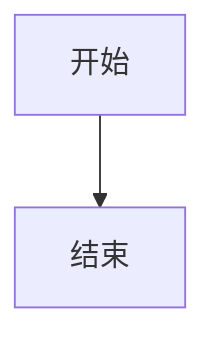

# Dr1ft0 的博客

> IT 运维工程师（基础架构方向）的工作记录与知识库

一个基于 **Hexo 7 + Butterfly 主题** 的个人技术博客，部署在 GitHub Pages，记录运维周记、故障复盘、技术笔记与知识沉淀。

🔗 **在线访问**：[https://dr1ft0.github.io/](https://dr1ft0.github.io/)

---

## ✨ 功能特性

### 📝 内容栏目

| 栏目 | 说明 |
|------|------|
| **运维周记** | 每周一篇，记录做了什么、学了什么、踩了什么坑 |
| **故障复盘** | 每个故障 24 小时内复盘：现象 → 排查 → 根因 → 修复 → 预防 |
| **技术笔记** | Linux / 网络 / 容器 / 自动化 的学习笔记 |
| **知识库索引** | 所有知识沉淀的总入口 |

### 🎨 主题美化

- **运维蓝 + 科技感配色**：主色 `#49b1f5`，强调色 `#00c4b6`
- **首页打字机副标题**：动态轮播个人简介
- **自定义 CSS**：滚动条渐变、卡片悬浮、标题渐变、表格美化、代码块圆角
- **背景特效**：粒子线条（canvas-nest）、鼠标点击烟花、爱心特效
- **暗黑模式**：自动切换（6:00-18:00）+ 手动按钮
- **阅读模式**：一键切换纯净阅读视图
- **繁简转换**：一键切换简体/繁体

### ⚙️ 功能增强

- **本地搜索**：支持 `Ctrl + /` 快捷键聚焦搜索框
- **文章目录（TOC）**：侧边栏目录 + 滚动百分比
- **相关文章推荐**：自动推荐 6 篇相关文章
- **字数统计 & 阅读时长**：文章字数、预计阅读时间
- **文章版权**：CC BY-NC-SA 4.0 协议
- **文章过期提醒**：超过 180 天的文章自动提示
- **代码块增强**：macStyle 风格、复制按钮、全屏查看
- **图片灯箱**：Fancybox 点击放大
- **Mermaid 图表**：支持绘制拓扑图、架构图
- **访问统计**：不蒜子 UV / PV 统计
- **分享功能**：微信、微博、QQ 一键分享
- **Pjax 无刷新跳转**：更流畅的浏览体验
- **返回顶部**：滚动超过 300px 自动显示

### 📄 页面

- 首页、归档、分类、标签
- 知识库索引
- 友链页（支持交换友链）
- 关于我
- 404 页面

---

## 🚀 快速开始

### 环境要求

- Node.js ≥ 18
- npm ≥ 9

### 本地开发

```bash
# 安装依赖
npm install

# 本地预览（默认 http://localhost:4000）
npm run server

# 生成静态文件
npm run build

# 清理缓存
npm run clean
```

### 部署

项目使用 **GitHub Actions** 自动部署到 `gh-pages` 分支，推送到 `main` 分支即可自动构建发布。

```bash
# 手动部署（可选）
npm run deploy
```

---

## 📝 写作指南

### 新建文章

```bash
# 普通文章
hexo new "文章标题"

# 周记（使用周记模板）
hexo new 周记 "2026-W36"

# 复盘（使用复盘模板）
hexo new 复盘 "故障标题"
```

### Front-matter 示例

```yaml
---
title: 文章标题
date: 2026-09-01 20:00:00
tags:
  - 标签1
  - 标签2
categories:
  - 分类名
cover: /img/cover.jpg   # 文章封面图（可选）
description: 文章摘要（可选）
top: false               # 是否置顶（可选）
---
```

### 常用标签插件

Butterfly 主题内置了丰富的标签插件：

```markdown
<!-- 提示框 -->
 提示内容 

<!-- 标签页 -->

<!-- tab 标签1 -->
内容1
<!-- endtab -->
<!-- tab 标签2 -->
内容2
<!-- endtab -->


<!-- 时间线 -->

<!-- timeline 2026-09-01 -->
内容
<!-- endtimeline -->


<!-- Mermaid 图表 -->

```

---

## 🗂 项目结构

```
Dr1ft0.github.io/
├── _config.yml              # Hexo 主配置
├── _config.butterfly.yml    # Butterfly 主题配置
├── package.json             # 依赖与脚本
├── scaffolds/               # 文章模板
│   ├── post.md              # 普通文章模板
│   ├── 周记.md              # 周记模板
│   └── 复盘.md              # 复盘模板
├── source/                  # 源文件
│   ├── _posts/              # 文章
│   ├── about/               # 关于页
│   ├── knowledge/           # 知识库索引
│   ├── links/               # 友链页
│   ├── tags/                # 标签页
│   ├── categories/          # 分类页
│   ├── 404.md               # 404 页面
│   ├── css/custom.css       # 自定义样式
│   └── js/custom.js         # 自定义脚本
└── themes/butterfly/        # Butterfly 主题
```

---

## ⚙️ 技术栈

| 技术 | 用途 |
|------|------|
| [Hexo](https://hexo.io/) | 静态博客框架 |
| [Butterfly](https://butterfly.js.org/) | 主题 |
| [GitHub Pages](https://pages.github.com/) | 托管 |
| [GitHub Actions](https://github.com/features/actions) | 自动部署 |
| [Mermaid](https://mermaid.js.org/) | 图表 |
| [Fancybox](https://fancyapps.com/fancybox/) | 图片灯箱 |
| [不蒜子](https://busuanzi.ibruce.info/) | 访问统计 |

---

## 🔧 常见问题

### 头像不显示？

将头像图片放到 `source/img/avatar.png`，或在 [`_config.butterfly.yml`](_config.butterfly.yml) 中修改 `avatar.img` 路径。

### 如何开启评论？

当前评论默认关闭。如需开启，推荐使用 **Giscus**（基于 GitHub Discussions）：

1. 前往 [giscus.app](https://giscus.app/) 配置
2. 在 [`_config.butterfly.yml`](_config.butterfly.yml) 的 `comments.use` 中填入配置

### 如何添加友链？

在 [`source/links/index.md`](source/links/index.md) 的 `` 标签中添加：

```yaml
- name: 你的名字
  link: https://你的博客地址
  avatar: https://你的头像地址
  descr: 一句话介绍
```

---

## 📄 许可证

- 博客源码：MIT License
- 文章内容：**CC BY-NC-SA 4.0**（署名-非商业性使用-相同方式共享）

---

## 📬 联系我

- GitHub：[dr1ft0](https://github.com/dr1ft0)
- 博客：[https://dr1ft0.github.io/](https://dr1ft0.github.io/)

> 记录运维路上的每一步 🚀