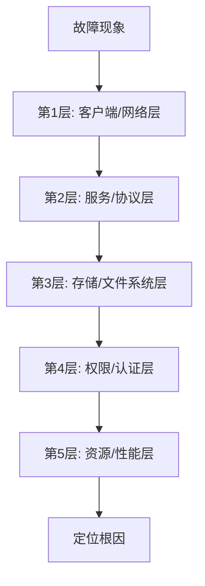
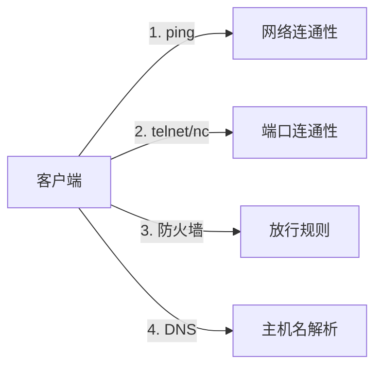
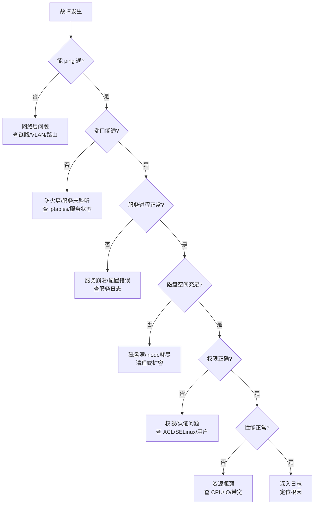

> **适用场景**：文件共享系统（Samba / NFS / Windows 共享 / OSS 等）出现访问异常、卡顿、权限报错、掉线等故障时的排查。
> **核心原则**：从外到内、从现象到根因，先看日志，逐层排除。
> **技术栈**：ping / nc / ss / systemctl / df / fsck / smbstatus / 日志分析。

---

## 一、排查总览：五层递进法

文件共享系统出问题时，不要一上来就猜，而是按 **"从外到内"** 的层次逐层排除：



**为什么从外到内？** 因为越外层的问题越常见、越容易排查。先确认"网络通不通、端口通不通"，再深入服务内部，能避免在错误的方向上浪费时间。

---

## 二、第 1 步：明确故障现象

排查前必须先确认现象，避免盲目操作。**先记录现象、时间点、影响范围**，再动手。

| 现象类型 | 典型表现 | 可能方向 |
|---------|---------|---------|
| 完全无法访问 | 挂载失败、连接超时 | 网络、服务未启动、防火墙 |
| 能连但很慢 | 打开文件卡顿、传输慢 | 带宽、磁盘 IO、并发 |
| 部分文件打不开 | 特定目录/文件报错 | 权限、文件损坏、路径 |
| 权限报错 | Permission denied | 认证、ACL、共享配置 |
| 偶发中断 | 传输中断、掉线 | 网络抖动、超时配置 |

> **关键**：现象不同，排查方向完全不同。比如"完全无法访问"和"能连但很慢"是两套完全不同的排查路径。

---

## 三、第 2 步：客户端与网络层排查（最外层）



**具体命令（以 Linux 客户端访问 Samba/NFS 为例）：**

```bash
# 1. 网络连通性测试
ping -c 4 <server_ip>

# 2. 端口连通性测试（Samba=445/139，NFS=2049）
telnet <server_ip> 445
nc -zv <server_ip> 2049

# 3. 检查本机防火墙
sudo iptables -L -n | grep 445
sudo ufw status

# 4. 检查 DNS/主机名解析
nslookup <server_hostname>
getent hosts <server_hostname>
```

**排查要点：**
- `ping` 不通 → 网络层问题（物理链路、VLAN、路由）
- `ping` 通但端口不通 → 服务端防火墙或服务未监听
- 端口通但挂载失败 → 进入下一层

---

## 四、第 3 步：服务与协议层排查（核心层）

确认服务进程是否存活、是否正常监听端口。**这一层最关键的是看日志。**

```bash
# 1. 检查服务进程状态
systemctl status smbd        # Samba
systemctl status nfs-server  # NFS
systemctl status sshd        # SFTP

# 2. 检查端口监听
ss -tlnp | grep -E '445|139|2049'

# 3. 查看服务日志（最关键！）
tail -f /var/log/samba/log.smbd
journalctl -u smbd -f
tail -f /var/log/messages | grep nfs

# 4. 查看当前连接会话
smbstatus          # Samba 当前连接
showmount -a       # NFS 当前挂载
```

**排查要点：**
- 服务未启动 → 查看日志找启动失败原因（配置错误、依赖缺失）
- 服务在但连接异常 → 看日志中的具体报错码
- **日志是定位问题的第一手资料，务必优先查看**

---

## 五、第 4 步：存储与文件系统层排查

确认底层磁盘、文件系统是否健康。**磁盘满是最常见的根因之一。**

```bash
# 1. 磁盘空间检查（共享目录所在分区）
df -h
df -i   # inode 是否耗尽（小文件多时常见）

# 2. 磁盘健康检查
sudo smartctl -a /dev/sda   # 硬件健康
dmesg | grep -i error       # 内核报错

# 3. 文件系统完整性
sudo fsck -n /dev/sda1      # 只读检查（需卸载）
sudo xfs_repair -n /dev/sda1  # XFS

# 4. 挂载状态
mount | grep -E 'samba|nfs'
```

**排查要点：**
- `df -h` 显示 100% → 磁盘满，最常见原因之一
- `df -i` 显示 100% → inode 耗尽（大量小文件）
- 磁盘报 IO 错误 → 硬件故障，需更换

---

## 六、第 5 步：权限与认证层排查

```bash
# 1. 检查共享目录权限
ls -ld /srv/share
getfacl /srv/share   # 查看 ACL

# 2. Samba 用户认证
pdbedit -L            # 列出 Samba 用户
testparm             # 校验 Samba 配置

# 3. NFS 导出配置
cat /etc/exports
exportfs -v          # 查看实际导出

# 4. 检查 SELinux/AppArmor
getenforce
ls -Z /srv/share     # SELinux 上下文
```

**排查要点：**
- 权限不足 → 调整目录权限或 ACL
- 认证失败 → 检查用户是否存在于 Samba 数据库
- SELinux 拦截 → 查看 `audit.log` 并调整上下文

---

## 七、第 6 步：资源与性能层排查

```bash
# 1. 系统负载
top / htop
uptime

# 2. 内存/交换分区
free -h

# 3. 磁盘 IO 性能
iostat -x 2
iotop

# 4. 网络带宽
iftop
nload

# 5. 并发连接数
smbstatus | wc -l
```

**排查要点：**
- CPU/内存高 → 服务过载，考虑扩容
- 磁盘 IO 高 → 存储瓶颈，考虑 SSD/缓存
- 网络带宽打满 → 限流或扩容带宽

---

## 八、完整排查决策树

把上面六步串成一张决策树，遇到故障按图索骥：



---

## 九、自动化排查与"查询、点击"实现

排查流程可以封装成脚本，再做成"点击即可"的 Web 界面，实现自动化运维。

### 1. 一键健康检查脚本

把上面的命令封装成 `health_check.sh`：

```bash
#!/bin/bash
# 一键健康检查脚本
SERVER_IP=$1
echo "=== 1. 网络连通性 ==="
ping -c 3 $SERVER_IP && echo "OK" || echo "FAIL"

echo "=== 2. 端口连通性 ==="
nc -zv $SERVER_IP 445 2>&1

echo "=== 3. 服务状态 ==="
ssh $SERVER_IP "systemctl status smbd --no-pager | head -5"

echo "=== 4. 磁盘空间 ==="
ssh $SERVER_IP "df -h | grep -E 'srv|Filesystem'"

echo "=== 5. 当前连接 ==="
ssh $SERVER_IP "smbstatus | head -20"
```

### 2. 做成"点击"的 Web 界面


**技术栈建议：**
- **后端**：Python (FastAPI/Flask) + 定时任务 (Celery)
- **前端**：Vue/React，按钮触发 API
- **监控**：Prometheus + Grafana（自动采集指标，异常告警）
- **告警**：Alertmanager → 钉钉/企业微信/邮件

### 3. 自动化运维的完整闭环


---

## 十、核心总结

**排查文件共享系统故障的黄金法则：**

1. **先看日志** —— 日志是定位问题的第一手资料，比任何猜测都可靠
2. **从外到内** —— 网络 → 服务 → 存储 → 权限 → 性能，逐层排除
3. **先复现再修复** —— 确认能稳定复现，修复后验证
4. **记录归档** —— 每次故障都记录，形成知识库，下次更快

**最常遇到的 5 个根因（按概率排序）：**

1. 磁盘空间满（`df -h` 100%）
2. 服务进程崩溃/未启动
3. 防火墙/安全组拦截端口
4. 权限/认证配置错误
5. 网络抖动或带宽瓶颈

**自动化方向：** 把排查命令封装成脚本 → 用 Web 界面"点击"触发 → 用 Prometheus 自动监控指标并告警 → 形成"监控-告警-自愈"闭环。

> **实战建议**：每遇到一个故障，处理完后回来在本篇对应步骤下补一行"实战记录"（现象 → 工具 → 根因），这张排查指南就会变成你的专属实战知识库。