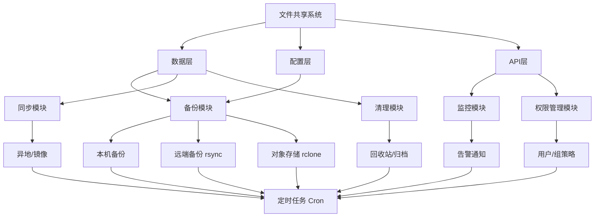

> **适用场景**：已部署成熟文件共享系统（Nextcloud / Seafile / Alist / FileBrowser / 自研等）的自动化运维。
> **核心诉求**：备份、监控、同步、清理、权限管理五大模块的自动化。
> **技术栈**：Shell + Python + Cron + rsync/rclone + 告警 Webhook。

---

## 一、自动化运维整体架构



---

## 二、五大自动化模块详解

### 模块 1：备份自动化（Backup）

**目标**：数据 + 配置 + 数据库 三重备份，可恢复，防单点故障。

| 备份对象 | 方式 | 频率 |
|---|---|---|
| 文件数据 | `rsync` 增量 / `tar` 归档 | 每日 |
| 数据库 | `mysqldump` / `pg_dump` / `sqlite3 .backup` | 每日 |
| 配置文件 | `tar` 打包 | 每次变更 |
| 本机备份 | 保留 N 天轮转 | 自动清理 |
| 远端备份 | `rsync` 到远端服务器 | 每日 |
| 对象存储 | `rclone` 到 S3/OSS/MinIO | 每日 |

**通用备份脚本逻辑（`backup.sh`）：**
```bash
#!/usr/bin/env bash
set -euo pipefail

# 配置
DATA_DIR="/path/to/data"          # 数据目录
DB_NAME="fileshare"               # 数据库名
BACKUP_DIR="/backup/daily"        # 本机备份目录
REMOTE_HOST="backup@remote"       # 远端服务器
REMOTE_DIR="/backup/fileshare"    # 远端备份目录
RCLONE_REMOTE="oss:fileshare"     # 对象存储
DATE=$(date +%Y%m%d_%H%M%S)
LOG="/var/log/fileshare-backup.log"

log() { echo "[$(date '+%F %T')] $*" | tee -a "$LOG"; }

# 1. 数据库备份
log "备份数据库..."
mysqldump -u backup -p"$DB_PASS" "$DB_NAME" > "${BACKUP_DIR}/db_${DATE}.sql"

# 2. 数据目录备份（tar 归档）
log "备份数据目录..."
tar -czf "${BACKUP_DIR}/data_${DATE}.tar.gz" -C "$(dirname "$DATA_DIR")" "$(basename "$DATA_DIR")"

# 3. 本机保留策略轮转（保留 7 天）
log "清理本机过期备份..."
find "$BACKUP_DIR" -name "*.tar.gz" -mtime +7 -delete
find "$BACKUP_DIR" -name "*.sql" -mtime +7 -delete

# 4. 同步到远端服务器（rsync over SSH）
log "同步到远端服务器..."
rsync -avz --delete "$BACKUP_DIR/" "${REMOTE_HOST}:${REMOTE_DIR}/"

# 5. 同步到对象存储（rclone）
log "同步到对象存储..."
rclone sync "$BACKUP_DIR" "$RCLONE_REMOTE" --backup-dir "${RCLONE_REMOTE}/old"

# 6. 校验
log "校验备份..."
if [ -s "${BACKUP_DIR}/data_${DATE}.tar.gz" ]; then
    log "备份成功: data_${DATE}.tar.gz"
else
    log "ERROR: 备份失败！"
    curl -s -X POST "https://oapi.dingtalk.com/robot/send?access_token=$DING_TOKEN" \
        -H 'Content-Type: application/json' \
        -d '{"msgtype":"text","text":{"content":"文件共享系统备份失败！"}}'
    exit 1
fi
log "备份完成"
```

---

### 模块 2：监控告警自动化（Monitoring）

**目标**：主动发现故障，而非被动响应。

| 监控项 | 指标 | 告警阈值 |
|---|---|---|
| 系统资源 | CPU / 内存 / 磁盘 | 磁盘 > 85% |
| 服务状态 | 进程 / 端口 / HTTP | 不可达即告警 |
| 数据增长 | 目录大小 / 文件数 | 异常突增 |
| 备份状态 | 备份是否成功 | 失败即告警 |
| 证书 | SSL 到期 | 提前 30 天 |

**通用监控脚本逻辑（`monitor.sh`）：**
```bash
#!/usr/bin/env bash
set -euo pipefail

# 配置
SERVICE_URL="https://fileshare.example.com"
DISK_THRESHOLD=85
LOG="/var/log/fileshare-monitor.log"
ALERT_URL="https://oapi.dingtalk.com/robot/send?access_token=$DING_TOKEN"

alert() { curl -s -X POST "$ALERT_URL" -H 'Content-Type: application/json' \
    -d "{\"msgtype\":\"text\",\"text\":{\"content\":\"$1\"}}"; }

# 1. 服务可用性检查
if ! curl -sf -o /dev/null "$SERVICE_URL"; then
    alert "⚠️ 文件共享系统不可达: $SERVICE_URL"
fi

# 2. 磁盘使用率检查
DISK_USAGE=$(df -h / | awk 'NR==2 {print $5}' | tr -d '%')
if [ "$DISK_USAGE" -gt "$DISK_THRESHOLD" ]; then
    alert "⚠️ 磁盘使用率过高: ${DISK_USAGE}%"
fi

# 3. 进程检查
if ! pgrep -f "fileshare" > /dev/null; then
    alert "⚠️ 文件共享进程未运行"
fi

# 4. SSL 证书到期检查
CERT_DAYS=$(echo | openssl s_client -servername fileshare.example.com \
    -connect fileshare.example.com:443 2>/dev/null | \
    openssl x509 -noout -enddate 2>/dev/null | cut -d= -f2)
# ... 计算剩余天数，<30 天告警
```

---

### 模块 3：同步自动化（Sync）

**目标**：多节点/异地容灾，或与外部存储同步。

| 场景 | 方式 |
|---|---|
| 异地备份 | `rsync` / `rclone` 到远端 |
| 对象存储 | `rclone` 同步到 S3/MinIO/OSS |
| 多节点实时 | `lsyncd` 实时同步 |
| 客户端 | 官方客户端 / WebDAV |

**通用同步脚本逻辑（`sync.sh`）：**
```bash
#!/usr/bin/env bash
set -euo pipefail

# 配置
LOCAL_DIR="/data/fileshare"
REMOTE_HOST="backup@remote"
REMOTE_DIR="/data/fileshare-mirror"
RCLONE_REMOTE="oss:fileshare"

# 1. rsync 增量同步到远端
rsync -avz --delete "$LOCAL_DIR/" "${REMOTE_HOST}:${REMOTE_DIR}/"

# 2. rclone 同步到对象存储
rclone sync "$LOCAL_DIR" "$RCLONE_REMOTE" --checksum

# 3. 记录同步状态
echo "[$(date '+%F %T')] 同步完成" >> /var/log/fileshare-sync.log
```

---

### 模块 4：清理自动化（Cleanup）

**目标**：控制存储成本，避免磁盘耗尽。

| 清理项 | 策略 |
|---|---|
| 回收站 | 保留 N 天自动清空 |
| 临时文件 | 定期删除 `/tmp`、上传缓存 |
| 过期分享 | 自动撤销过期分享链接 |
| 日志轮转 | `logrotate` 压缩归档 |
| 大文件审计 | 定期扫描 Top N 大文件 |

**通用清理脚本逻辑（`cleanup.sh`）：**
```bash
#!/usr/bin/env bash
set -euo pipefail

# 配置
RECYCLE_DIR="/data/fileshare/.trash"
TMP_DIR="/tmp/fileshare-upload"
RETENTION_DAYS=30
LOG="/var/log/fileshare-cleanup.log"

# 1. 清理回收站（保留 30 天）
find "$RECYCLE_DIR" -type f -mtime +$RETENTION_DAYS -delete
find "$RECYCLE_DIR" -type d -empty -delete

# 2. 清理临时上传文件
find "$TMP_DIR" -type f -mtime +7 -delete

# 3. 大文件审计（Top 20）
echo "=== Top 20 大文件 ===" >> "$LOG"
du -ah /data/fileshare | sort -rh | head -20 >> "$LOG"

# 4. 磁盘空间报告
df -h /data >> "$LOG"
```

---

### 模块 5：权限管理自动化（Permission）

**目标**：权限规范化、可审计、可回收。

| 场景 | 自动化逻辑 |
|---|---|
| 新用户入职 | 脚本自动创建账号 + 分配默认组 |
| 用户离职 | 自动禁用账号 + 转移/归档数据 |
| 定期审计 | 扫描异常权限、过期账号 |
| 分享管理 | 统一设置分享有效期 |

**通用权限管理脚本逻辑（`permission.sh`）：**
```bash
#!/usr/bin/env bash
set -euo pipefail

# 配置
API_BASE="https://fileshare.example.com/api"
API_TOKEN="$FILESHARE_API_TOKEN"
LOG="/var/log/fileshare-permission.log"

# 1. 新用户入职（从 CSV 读取）
# 格式: username,group,email
while IFS=, read -r user group email; do
    curl -s -X POST "$API_BASE/users" \
        -H "Authorization: Bearer $API_TOKEN" \
        -H 'Content-Type: application/json' \
        -d "{\"username\":\"$user\",\"group\":\"$group\",\"email\":\"$email\"}"
    echo "[$(date '+%F %T')] 创建用户: $user" >> "$LOG"
done < /etc/fileshare/new_users.csv

# 2. 用户离职（从 CSV 读取）
while IFS=, read -r user; do
    curl -s -X POST "$API_BASE/users/$user/disable" \
        -H "Authorization: Bearer $API_TOKEN"
    echo "[$(date '+%F %T')] 禁用用户: $user" >> "$LOG"
done < /etc/fileshare/disabled_users.csv

# 3. 定期权限审计（扫描 90 天未登录账号）
curl -s "$API_BASE/users?last_login_before=90d" \
    -H "Authorization: Bearer $API_TOKEN" >> "$LOG"
```

---

## 三、远端备份配置（rsync / rclone）

### 方式 A：rsync over SSH（远端 Linux 服务器）

**1. 配置 SSH 免密登录：**
```bash
# 在源服务器生成密钥
ssh-keygen -t ed25519

# 将公钥复制到远端服务器
ssh-copy-id backup@remote-server
```

**2. 测试 rsync：**
```bash
rsync -avz /data/fileshare/ backup@remote-server:/backup/fileshare/
```

**3. 加入备份脚本**（见模块 1 第 4 步）。

### 方式 B：rclone（对象存储 / 云盘）

**1. 安装并配置 rclone：**
```bash
# 安装
curl https://rclone.org/install.sh | sudo bash

# 交互式配置远端（选择 S3/OSS/MinIO 等）
rclone config
```

**2. 测试 rclone：**
```bash
rclone ls oss:fileshare
```

**3. 加入备份脚本**（见模块 1 第 5 步）。

---

## 四、Cron 定时任务配置

**编辑 crontab：**
```bash
crontab -e
```

**添加定时任务：**
```cron
# 每日 02:00 备份
0 2 * * * /opt/scripts/backup.sh

# 每 5 分钟监控
*/5 * * * * /opt/scripts/monitor.sh

# 每日 03:00 同步
0 3 * * * /opt/scripts/sync.sh

# 每日 04:00 清理
0 4 * * * /opt/scripts/cleanup.sh

# 每周一 05:00 权限审计
0 5 * * 1 /opt/scripts/permission.sh
```

---

## 五、告警通知配置

支持钉钉 / 企业微信 / 邮件 / Slack Webhook。

**钉钉机器人示例：**
```bash
curl -s -X POST "https://oapi.dingtalk.com/robot/send?access_token=$DING_TOKEN" \
    -H 'Content-Type: application/json' \
    -d '{"msgtype":"text","text":{"content":"文件共享系统告警"}}'
```

---

## 六、实施路线图

### 阶段一：备份与恢复（保命）
- [ ] 编写备份脚本（数据 + 配置 + 数据库）
- [ ] 配置本机 + 远端（rsync/rclone）备份
- [ ] 配置 Cron 定时任务
- [ ] **演练恢复流程**（关键！）

### 阶段二：监控与告警（感知）
- [ ] 部署监控脚本（磁盘/服务/备份状态）
- [ ] 接入钉钉/企业微信告警

### 阶段三：同步与清理（优化）
- [ ] 配置异地/对象存储同步
- [ ] 配置回收站与临时文件清理
- [ ] 配置日志轮转

### 阶段四：权限与审计（规范）
- [ ] 编写用户生命周期管理脚本
- [ ] 配置定期权限审计

---

## 七、注意事项

1. **备份存储位置**：务必**本机 + 远端双备份**，避免单点故障。
2. **数据库一致性**：备份数据库前先停止写入或使用快照，避免不一致。
3. **恢复演练**：定期（如每月）在测试环境演练恢复，确保备份可用。
4. **密钥安全**：SSH 密钥、API Token 使用环境变量或密钥管理，勿硬编码。
5. **日志审计**：所有自动化操作记录日志，便于追溯。