> **适用场景**：理解公司"网络位置"文件共享系统的底层原理，掌握 SMB/NFS/WebDAV 协议栈与权限安全机制。
> **核心内容**：企业级文件共享系统（EFSS）架构、Z盘底层逻辑、Windows 访问流程、协议功能详解。
> **技术栈**：SMB/CIFS、NFS、WebDAV、Kerberos/NTLM、LDAP/AD、对象存储。

---

## 一、企业级文件共享系统是什么

### 1.1 一句话概括

一个挂载在员工电脑上像本地磁盘一样使用，但实际数据存储在公司服务器上，并且**谁能看、谁能改、谁能分享给外部全部由管理员掌控**的系统。

它和百度网盘、Dropbox 这类个人网盘的核心区别在于：**权限管控、组织架构对接、审计合规、内外网隔离**。

### 1.2 典型产品

| 类型 | 产品 |
|---|---|
| 开源/自建 | Nextcloud、ownCloud、Seafile、MinIO |
| 商业产品 | 联想企业网盘、坚果云企业版、亿方云、OneDrive for Business、Google Drive Enterprise |
| 传统存储厂商 | 群晖 Drive、威联通、NetApp、戴尔 Isilon + 权限网关 |

### 1.3 用户看到的"网络位置"

员工在电脑上打开"此电脑"或"Finder"，会看到一个类似这样的盘符：

```
网络位置
├── Z: 盘（公司共享盘）
│   ├── 📁 公共资料库
│   ├── 📁 部门文件夹
│   │   ├── 研发部
│   │   ├── 市场部
│   │   └── 财务部
│   ├── 📁 项目空间
│   │   ├── 项目A（仅项目成员可见）
│   │   └── 项目B
│   └── 📁 我的个人空间
```

这个"Z 盘"背后可能是：

| 技术协议 | 说明 |
|---|---|
| SMB/CIFS | Windows 网络共享，最传统的方式 |
| NFS | Linux/Unix 环境常用 |
| WebDAV | 基于 HTTP，跨平台，适合远程挂载 |
| 专用客户端 | 如 Nextcloud Desktop、坚果云客户端，自动同步 |

---

## 二、核心架构

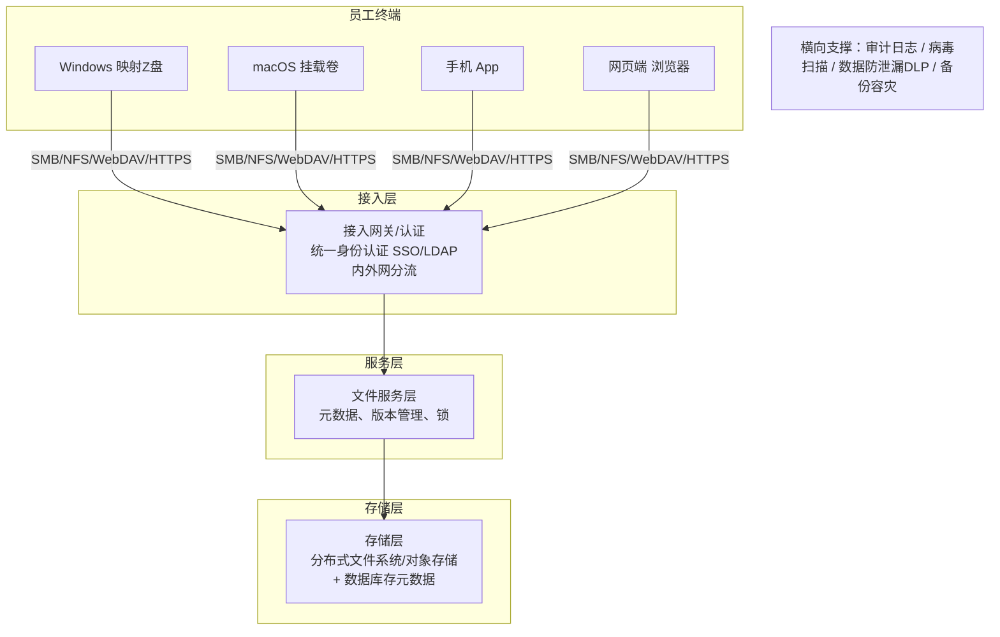
```mermaid
graph TD
    subgraph 员工终端
        A1[Windows 映射Z盘]
        A2[macOS 挂载卷]
        A3[手机 App]
        A4[网页端 浏览器]
    end

    subgraph 接入层
        B[接入网关/认证<br/>统一身份认证 SSO/LDAP<br/>内外网分流]
    end

    subgraph 服务层
        C[文件服务层<br/>元数据、版本管理、锁]
    end

    subgraph 存储层
        D[存储层<br/>分布式文件系统/对象存储<br/>+ 数据库存元数据]
    end

    A1 -->|SMB/NFS/WebDAV/HTTPS| B
    A2 -->|SMB/NFS/WebDAV/HTTPS| B
    A3 -->|SMB/NFS/WebDAV/HTTPS| B
    A4 -->|SMB/NFS/WebDAV/HTTPS| B
    B --> C
    C --> D

    E[横向支撑：审计日志 / 病毒扫描 / 数据防泄漏DLP / 备份容灾]
```

---

## 三、权限模型（核心中的核心）

企业文件系统最复杂的不是存储文件，而是**"谁能访问什么"**。

### 3.1 典型权限层级

```
文件/文件夹
│
├── 继承权限（从父文件夹继承）
│
├── 显式权限（单独设置）
│
└── 权限类型
    ├── 只读（可看不可改）
    ├── 读写（可修改）
    ├── 完全控制（可改权限）
    ├── 不可见（连存在都不知道）
    └── 仅上传（如收集作业/报名的"投递箱"）
```

### 3.2 权限来源

| 来源 | 示例 |
|---|---|
| 组织架构 | 财务部的人自动看到财务部文件夹 |
| 用户组 | "项目A成员组"自动看到项目A空间 |
| 角色 | "部门经理"比普通员工多管理权限 |
| 单独授权 | 特殊情况下单独给某个人开权限 |
| 分享链接 | 临时给外部人员一个带密码和有效期的链接 |

---

## 四、内部 vs 外部访问

这是企业文件系统区别于个人网盘的关键设计。

### 4.1 内部访问

```
员工 ──▶ 公司内网 ──▶ 文件服务器
              │
              └── 通过 LDAP/AD 域账号自动登录
                  权限与组织架构自动同步
```

### 4.2 外部访问（外部协作）

```
外部合作伙伴 ──▶ 互联网 ──▶ 反向代理/DMZ区 ──▶ 文件服务器
                                    │
                                    ├── 独立的外部账号体系
                                    ├── 仅能访问被明确分享的文件
                                    ├── 链接带密码 + 有效期
                                    ├── 可设置禁止下载/仅预览
                                    └── 所有操作完整审计
```

### 4.3 典型安全策略

| 策略 | 说明 |
|---|---|
| 内外网隔离 | 外部访问只能走 DMZ 区的网关，不能直达内网存储 |
| 分享审批 | 对外分享需要上级审批 |
| 水印 | 预览时显示访客姓名水印，防截图泄露 |
| 禁止下载 | 外部人员只能在线预览，不能下载原始文件 |
| 过期自动失效 | 分享链接 7 天后自动失效 |
| DLP 扫描 | 检测到含敏感词（如"机密""身份证号"）的文件自动阻断外发 |

### 4.4 具体场景演示

**场景**：研发部要把一份《产品规格说明书 V2.0》分享给外部供应商

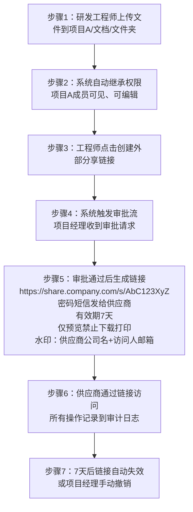
```mermaid
graph TD
    A[步骤1：研发工程师上传文件到项目A/文档/文件夹] --> B[步骤2：系统自动继承权限<br/>项目A成员可见、可编辑]
    B --> C[步骤3：工程师点击创建外部分享链接]
    C --> D[步骤4：系统触发审批流<br/>项目经理收到审批请求]
    D --> E[步骤5：审批通过后生成链接<br/>https://share.company.com/s/AbC123XyZ<br/>密码短信发给供应商<br/>有效期7天<br/>仅预览禁止下载打印<br/>水印：供应商公司名+访问人邮箱]
    E --> F[步骤6：供应商通过链接访问<br/>所有操作记录到审计日志]
    F --> G[步骤7：7天后链接自动失效<br/>或项目经理手动撤销]
```

---

## 五、底层技术选型

| 组件 | 常见方案 |
|---|---|
| 文件存储 | 对象存储（MinIO/Ceph/S3）、NAS、分布式文件系统（GlusterFS） |
| 元数据库 | MySQL/PostgreSQL（存文件名、路径、权限、版本） |
| 文件索引 | Elasticsearch（全文搜索） |
| 认证 | LDAP/AD 对接、SAML/OIDC 单点登录 |
| 文件预览 | LibreOffice 转 PDF、OnlyOffice/Collabora 在线编辑 |
| 病毒扫描 | ClamAV 集成 |
| 审计 | 操作日志入 Kafka → ES → 可视化 |
| 同步客户端 | 自研或基于开源的桌面同步引擎 |

### 常见开源方案对比

| 方案 | 特点 | 适合场景 |
|---|---|---|
| Nextcloud | 功能全，插件丰富，社区活跃 | 中小型企业自建 |
| Seafile | 性能好，分块存储，同步快 | 注重速度和可靠性 |
| MinIO + 自研 | 纯对象存储，需自己开发上层 | 有研发能力的公司 |
| Samba + AD | 传统 Windows 共享，零学习成本 | 纯内网、简单场景 |
| 群晖/威联通 | 软硬一体，开箱即用 | 小型办公室 |

---

## 六、Z盘文件共享系统的底层逻辑

### 6.1 整体架构概览

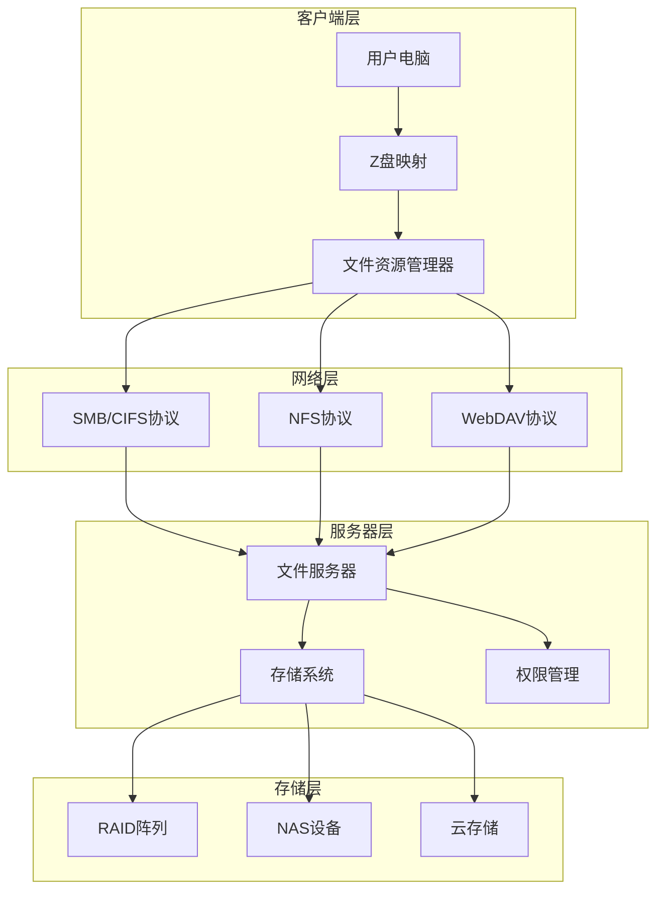
```mermaid
graph TB
    subgraph 客户端层
        A[用户电脑] --> B[Z盘映射]
        B --> C[文件资源管理器]
    end

    subgraph 网络层
        D[SMB/CIFS协议]
        E[NFS协议]
        F[WebDAV协议]
    end

    subgraph 服务器层
        G[文件服务器]
        H[存储系统]
        I[权限管理]
    end

    subgraph 存储层
        J[RAID阵列]
        K[NAS设备]
        L[云存储]
    end

    C --> D
    C --> E
    C --> F
    D --> G
    E --> G
    F --> G
    G --> I
    G --> H
    H --> J
    H --> K
    H --> L
```

### 6.2 核心底层逻辑

**文件共享协议栈：**

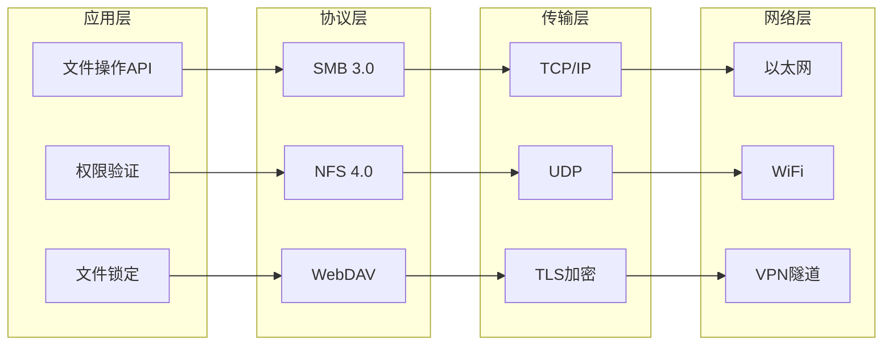
```mermaid
graph LR
    subgraph 应用层
        A1[文件操作API]
        A2[权限验证]
        A3[文件锁定]
    end

    subgraph 协议层
        B1[SMB 3.0]
        B2[NFS 4.0]
        B3[WebDAV]
    end

    subgraph 传输层
        C1[TCP/IP]
        C2[UDP]
        C3[TLS加密]
    end

    subgraph 网络层
        D1[以太网]
        D2[WiFi]
        D3[VPN隧道]
    end

    A1 --> B1
    A2 --> B2
    A3 --> B3
    B1 --> C1
    B2 --> C2
    B3 --> C3
    C1 --> D1
    C2 --> D2
    C3 --> D3
```

**数据流转过程：**

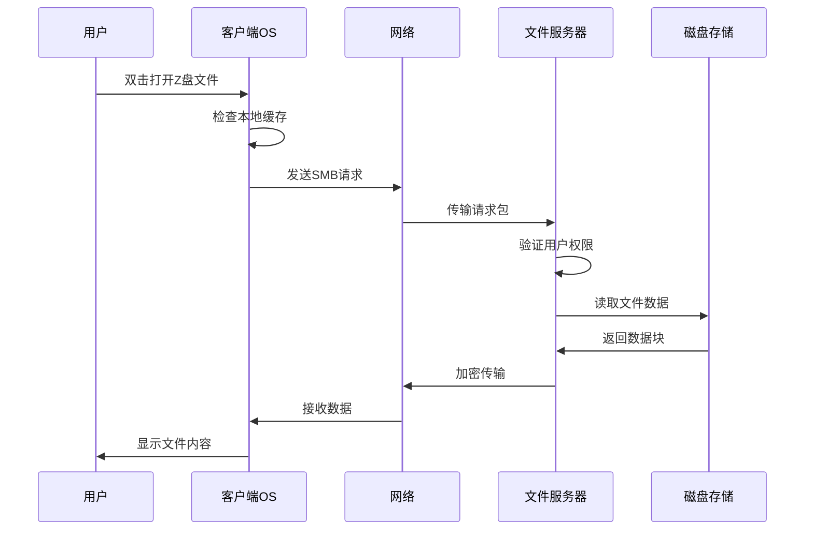
```mermaid
sequenceDiagram
    participant U as 用户
    participant C as 客户端OS
    participant N as 网络
    participant S as 文件服务器
    participant D as 磁盘存储

    U->>C: 双击打开Z盘文件
    C->>C: 检查本地缓存
    C->>N: 发送SMB请求
    N->>S: 传输请求包
    S->>S: 验证用户权限
    S->>D: 读取文件数据
    D->>S: 返回数据块
    S->>N: 加密传输
    N->>C: 接收数据
    C->>U: 显示文件内容
```

### 6.3 技术栈详解

**核心协议栈：**

| 协议 | 平台 | 版本演进 | 特性 |
|---|---|---|---|
| SMB/CIFS | Windows 原生支持 | SMB 1.0 → 2.0 → 3.0 | 文件锁定、机会锁、多通道 |
| NFS | Linux/Unix 系统 | NFSv3 → NFSv4 | 无状态设计、文件句柄 |
| WebDAV | 跨平台 | 基于 HTTP | 适合互联网 |

**存储技术栈：**

| 层次 | 技术 | 说明 |
|---|---|---|
| 物理层 | HDD/SSD | 实际存储介质 |
| RAID层 | RAID 0/1/5/6/10 | 数据冗余和性能优化 |
| 文件系统 | NTFS/ext4/ZFS | 文件组织和管理 |
| 卷管理 | LVM/存储池 | 灵活的存储分配 |
| 共享层 | SMB/NFS服务 | 网络文件共享 |

**安全机制：**

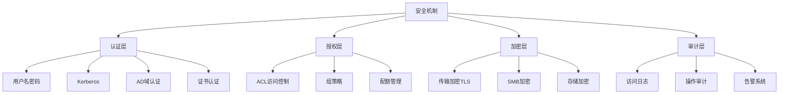
```mermaid
graph TB
    A[安全机制] --> B[认证层]
    A --> C[授权层]
    A --> D[加密层]
    A --> E[审计层]

    B --> F[用户名密码]
    B --> G[Kerberos]
    B --> H[AD域认证]
    B --> I[证书认证]

    C --> J[ACL访问控制]
    C --> K[组策略]
    C --> L[配额管理]

    D --> M[传输加密TLS]
    D --> N[SMB加密]
    D --> O[存储加密]

    E --> P[访问日志]
    E --> Q[操作审计]
    E --> R[告警系统]
```

### 6.4 关键组件实现

**文件服务器核心逻辑：**

```python
# 简化的文件服务器核心逻辑
class FileServer:
    def __init__(self):
        self.storage_manager = StorageManager()
        self.auth_service = AuthenticationService()
        self.lock_manager = LockManager()
        self.cache_manager = CacheManager()

    def handle_request(self, request):
        # 1. 认证
        user = self.auth_service.authenticate(request.credentials)

        # 2. 授权
        if not self.check_permission(user, request.file_path):
            return Error("Permission denied")

        # 3. 处理请求
        if request.type == "READ":
            return self.read_file(request.file_path, request.offset, request.length)
        elif request.type == "WRITE":
            return self.write_file(request.file_path, request.data)
        elif request.type == "LOCK":
            return self.lock_manager.acquire_lock(request.file_path, user)
```

**缓存机制：**

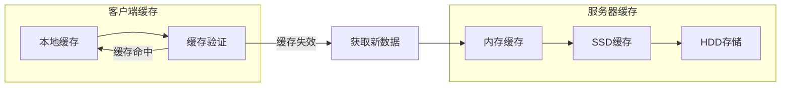
```mermaid
graph LR
    subgraph 客户端缓存
        A[本地缓存] --> B[缓存验证]
    end

    subgraph 服务器缓存
        C[内存缓存]
        D[SSD缓存]
        E[HDD存储]
    end

    B -->|缓存命中| A
    B -->|缓存失效| F[获取新数据]
    F --> C
    C --> D
    D --> E
```

### 6.5 性能优化策略

**网络优化：**
- 多通道 SMB：利用多个网络接口并行传输
- RDMA：远程直接内存访问，减少 CPU 开销
- 数据压缩：减少网络传输量

**存储优化：**
- 分层存储：热数据在 SSD，冷数据在 HDD
- 数据去重：减少存储空间占用
- 预读取：提前加载可能访问的数据

**缓存策略：**

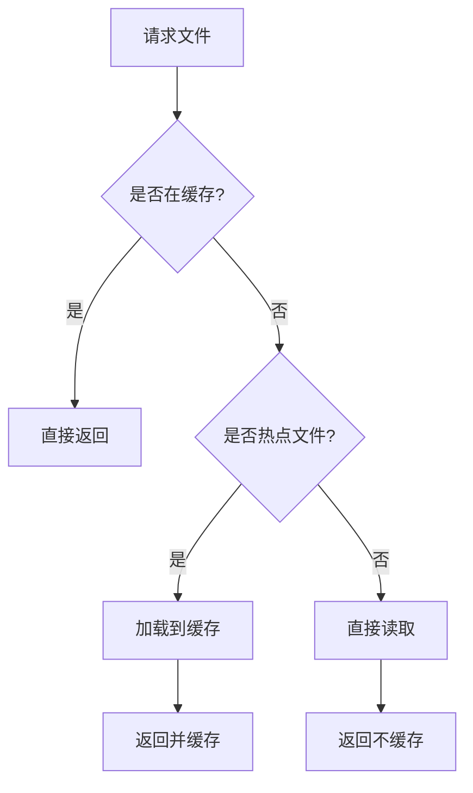
```mermaid
graph TB
    A[请求文件] --> B{是否在缓存?}
    B -->|是| C[直接返回]
    B -->|否| D{是否热点文件?}
    D -->|是| E[加载到缓存]
    D -->|否| F[直接读取]
    E --> G[返回并缓存]
    F --> H[返回不缓存]
```

### 6.6 故障恢复机制

**高可用架构：**

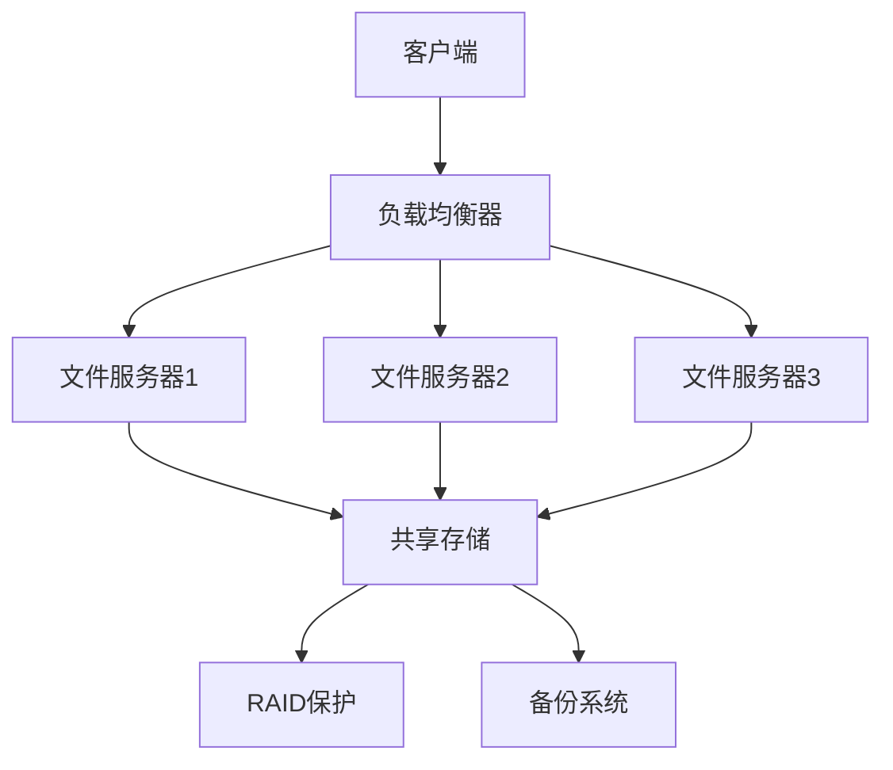
```mermaid
graph TB
    A[客户端] --> B[负载均衡器]
    B --> C[文件服务器1]
    B --> D[文件服务器2]
    B --> E[文件服务器3]

    C --> F[共享存储]
    D --> F
    E --> F

    F --> G[RAID保护]
    F --> H[备份系统]
```

**数据保护：**
- 快照：定期创建文件系统快照
- 复制：实时或定时数据复制
- 备份：完整备份和增量备份

### 6.7 实际部署示例

**Windows Server SMB 共享配置：**

```powershell
# 创建共享文件夹
New-Item -Path "D:\Shared" -ItemType Directory

# 配置SMB共享
New-SmbShare -Name "ZDrive" -Path "D:\Shared" -FullAccess "Domain\Users"

# 启用SMB加密
Set-SmbShare -Name "ZDrive" -EncryptData $true

# 启用访问审计
Set-SmbShare -Name "ZDrive" -AuditSmb1Access $true
```

**Linux NFS 共享配置：**

```bash
# 安装NFS服务
sudo apt-get install nfs-kernel-server

# 配置导出
echo "/srv/shared 192.168.1.0/24(rw,sync,no_subtree_check)" >> /etc/exports

# 应用配置
sudo exportfs -a
```

---

## 七、Windows 系统下的完整访问流程

### 7.1 整体架构

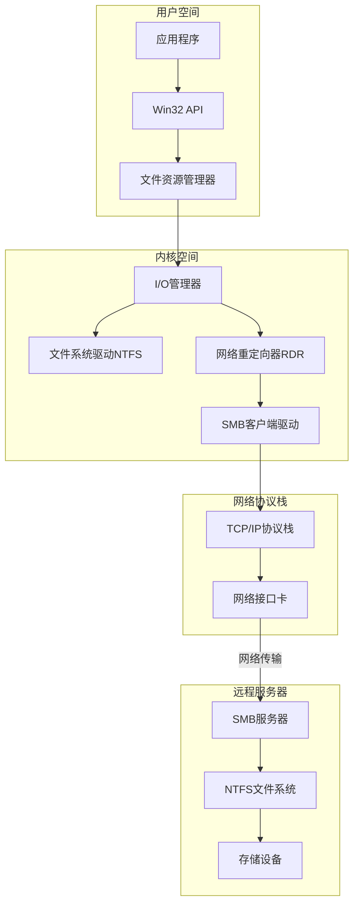
```mermaid
graph TB
    subgraph 用户空间
        A[应用程序] --> B[Win32 API]
        B --> C[文件资源管理器]
    end

    subgraph 内核空间
        D[I/O管理器]
        E[文件系统驱动NTFS]
        F[网络重定向器RDR]
        G[SMB客户端驱动]
    end

    subgraph 网络协议栈
        H[TCP/IP协议栈]
        I[网络接口卡]
    end

    subgraph 远程服务器
        J[SMB服务器]
        K[NTFS文件系统]
        L[存储设备]
    end

    C --> D
    D --> E
    D --> F
    F --> G
    G --> H
    H --> I
    I -->|网络传输| J
    J --> K
    K --> L
```

### 7.2 文件访问初始化流程

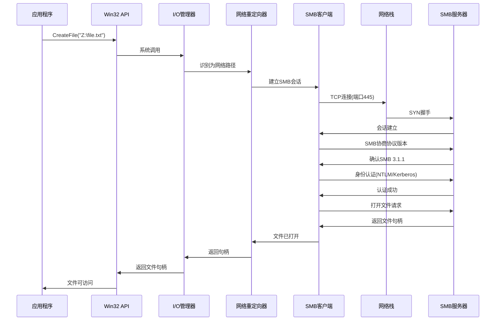
```mermaid
sequenceDiagram
    participant App as 应用程序
    participant API as Win32 API
    participant IOM as I/O管理器
    participant RDR as 网络重定向器
    participant SMB as SMB客户端
    participant Net as 网络栈
    participant Server as SMB服务器

    App->>API: CreateFile("Z:\file.txt")
    API->>IOM: 系统调用
    IOM->>RDR: 识别为网络路径
    RDR->>SMB: 建立SMB会话
    SMB->>Net: TCP连接(端口445)
    Net->>Server: SYN握手
    Server->>SMB: 会话建立
    SMB->>Server: SMB协商协议版本
    Server->>SMB: 确认SMB 3.1.1
    SMB->>Server: 身份认证(NTLM/Kerberos)
    Server->>SMB: 认证成功
    SMB->>Server: 打开文件请求
    Server->>SMB: 返回文件句柄
    SMB->>RDR: 文件已打开
    RDR->>IOM: 返回句柄
    IOM->>API: 返回文件句柄
    API->>App: 文件可访问
```

### 7.3 文件读取流程

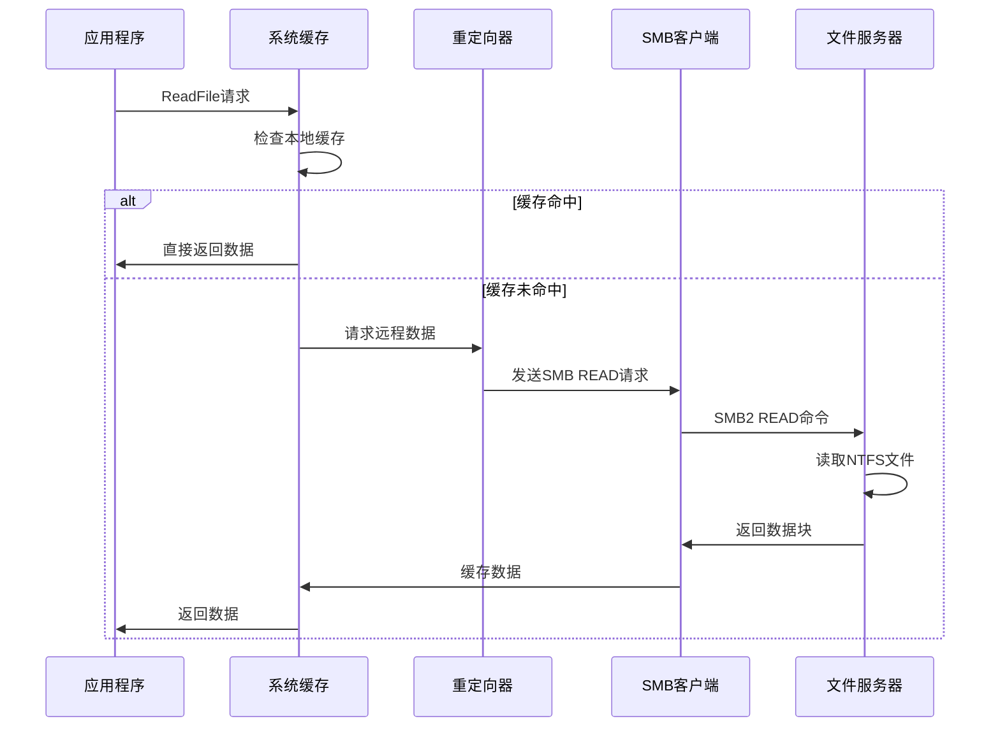
```mermaid
sequenceDiagram
    participant App as 应用程序
    participant Cache as 系统缓存
    participant RDR as 重定向器
    participant SMB as SMB客户端
    participant Server as 文件服务器

    App->>Cache: ReadFile请求
    Cache->>Cache: 检查本地缓存

    alt 缓存命中
        Cache->>App: 直接返回数据
    else 缓存未命中
        Cache->>RDR: 请求远程数据
        RDR->>SMB: 发送SMB READ请求
        SMB->>Server: SMB2 READ命令
        Server->>Server: 读取NTFS文件
        Server->>SMB: 返回数据块
        SMB->>Cache: 缓存数据
        Cache->>App: 返回数据
    end
```

### 7.4 文件写入流程

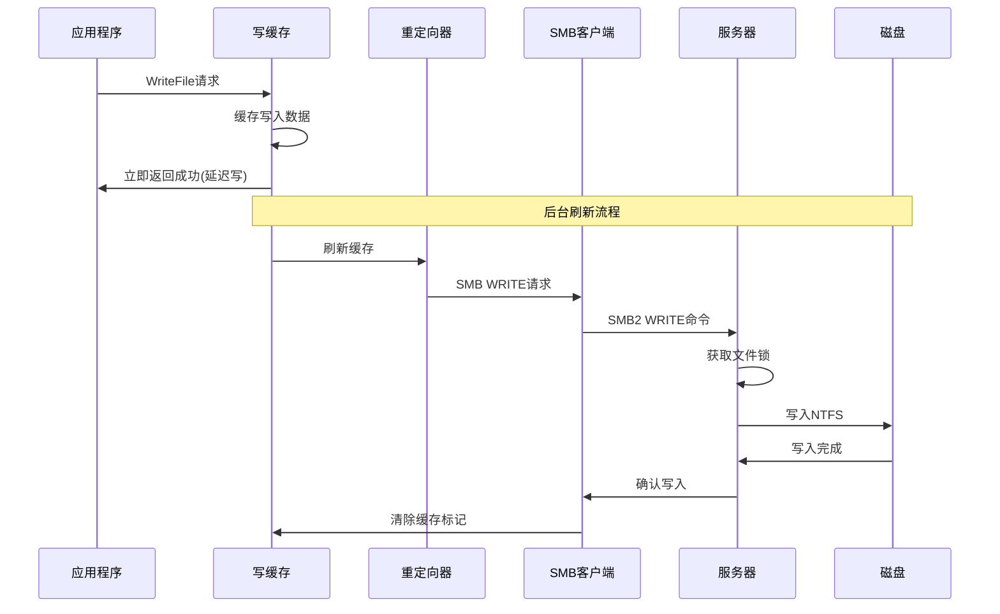
```mermaid
sequenceDiagram
    participant App as 应用程序
    participant Cache as 写缓存
    participant RDR as 重定向器
    participant SMB as SMB客户端
    participant Server as 服务器
    participant Disk as 磁盘

    App->>Cache: WriteFile请求
    Cache->>Cache: 缓存写入数据
    Cache->>App: 立即返回成功(延迟写)

    Note over Cache,Disk: 后台刷新流程
    Cache->>RDR: 刷新缓存
    RDR->>SMB: SMB WRITE请求
    SMB->>Server: SMB2 WRITE命令
    Server->>Server: 获取文件锁
    Server->>Disk: 写入NTFS
    Disk->>Server: 写入完成
    Server->>SMB: 确认写入
    SMB->>Cache: 清除缓存标记
```

---

## 八、各协议功能详解

### 8.1 SMB 协议（Server Message Block）

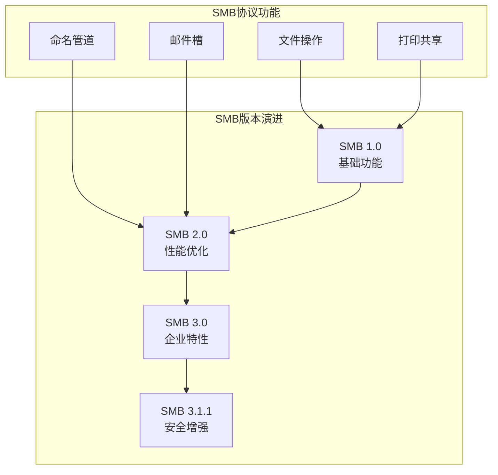
```mermaid
graph TB
    subgraph SMB协议功能
        A[文件操作]
        B[打印共享]
        C[命名管道]
        D[邮件槽]
    end

    subgraph SMB版本演进
        E[SMB 1.0<br/>基础功能]
        F[SMB 2.0<br/>性能优化]
        G[SMB 3.0<br/>企业特性]
        H[SMB 3.1.1<br/>安全增强]
    end

    A --> E
    B --> E
    C --> F
    D --> F
    E --> F
    F --> G
    G --> H
```

**SMB 核心功能：**
- 文件访问：打开、读取、写入、关闭文件
- 目录操作：创建、删除、重命名目录
- 文件锁定：防止并发写入冲突
- 机会锁（OpLock）：客户端缓存优化

### 8.2 NetBIOS 协议

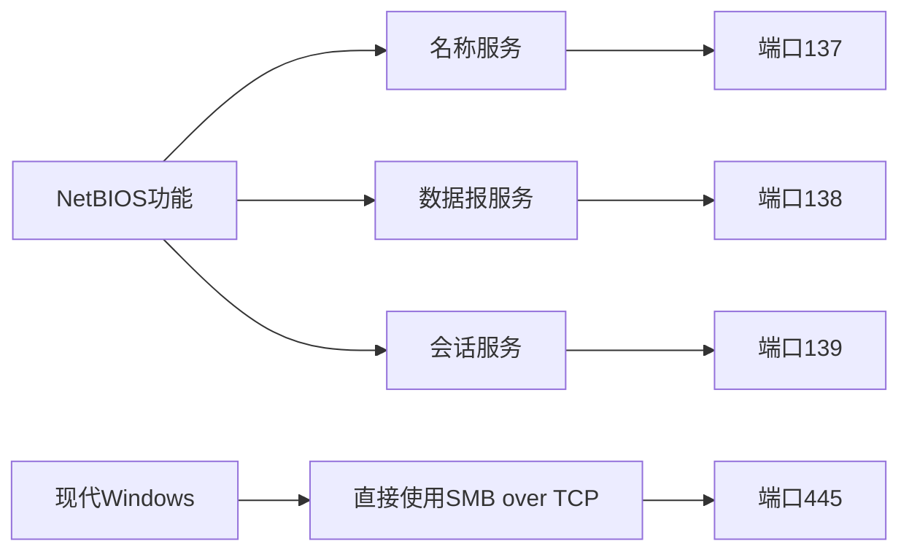
```mermaid
graph LR
    A[NetBIOS功能] --> B[名称服务]
    A --> C[数据报服务]
    A --> D[会话服务]

    B --> E[端口137]
    C --> F[端口138]
    D --> G[端口139]

    H[现代Windows] --> I[直接使用SMB over TCP]
    I --> J[端口445]
```

### 8.3 Kerberos 认证协议

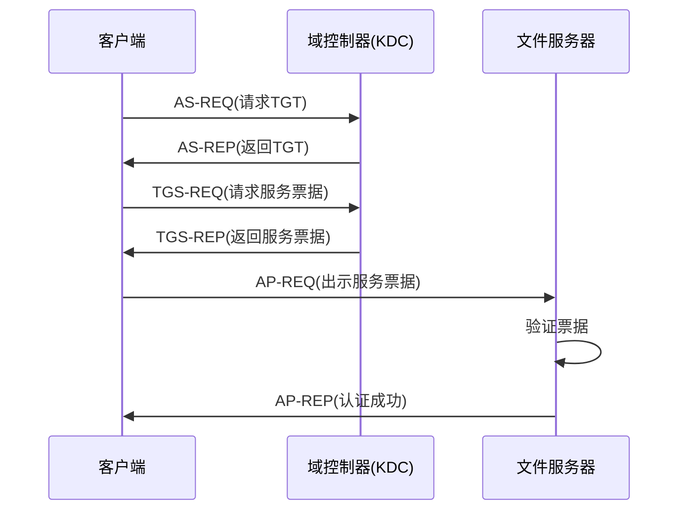
```mermaid
sequenceDiagram
    participant C as 客户端
    participant KDC as 域控制器(KDC)
    participant S as 文件服务器

    C->>KDC: AS-REQ(请求TGT)
    KDC->>C: AS-REP(返回TGT)
    C->>KDC: TGS-REQ(请求服务票据)
    KDC->>C: TGS-REP(返回服务票据)
    C->>S: AP-REQ(出示服务票据)
    S->>S: 验证票据
    S->>C: AP-REP(认证成功)
```

---

## 九、Windows 网络重定向器机制

### 9.1 重定向器工作原理

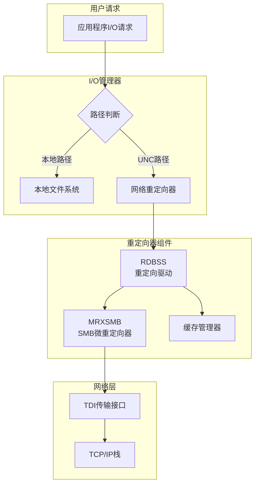
```mermaid
graph TB
    subgraph 用户请求
        A[应用程序I/O请求]
    end

    subgraph I/O管理器
        B{路径判断}
        C[本地文件系统]
        D[网络重定向器]
    end

    subgraph 重定向器组件
        E[RDBSS<br/>重定向驱动]
        F[MRXSMB<br/>SMB微重定向器]
        G[缓存管理器]
    end

    subgraph 网络层
        H[TDI传输接口]
        I[TCP/IP栈]
    end

    A --> B
    B -->|本地路径| C
    B -->|UNC路径| D
    D --> E
    E --> F
    E --> G
    F --> H
    H --> I
```

### 9.2 缓存机制详解

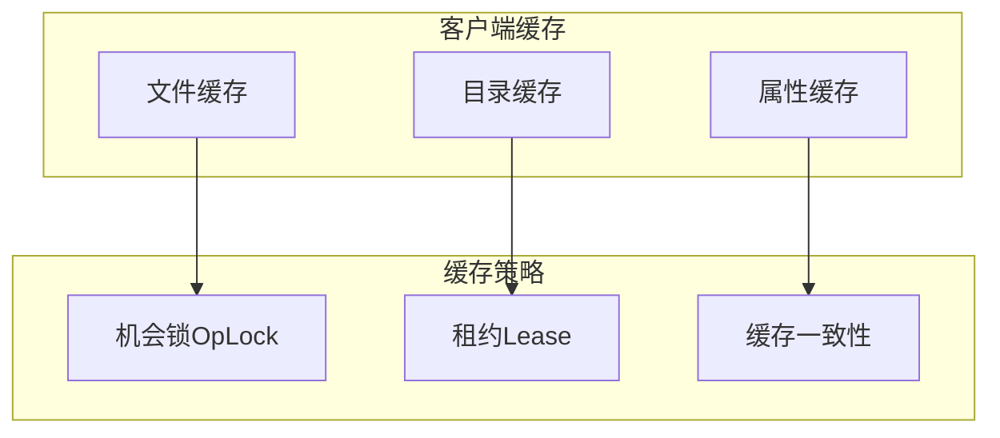
```mermaid
graph TB
    subgraph 客户端缓存
        A[文件缓存]
        B[目录缓存]
        C[属性缓存]
    end

    subgraph 缓存策略
        D[机会锁OpLock]
        E[租约Lease]
        F[缓存一致性]
    end

    A --> D
    B --> E
    C --> F
```

---

## 十、Windows 文件共享安全机制

### 10.1 权限检查流程

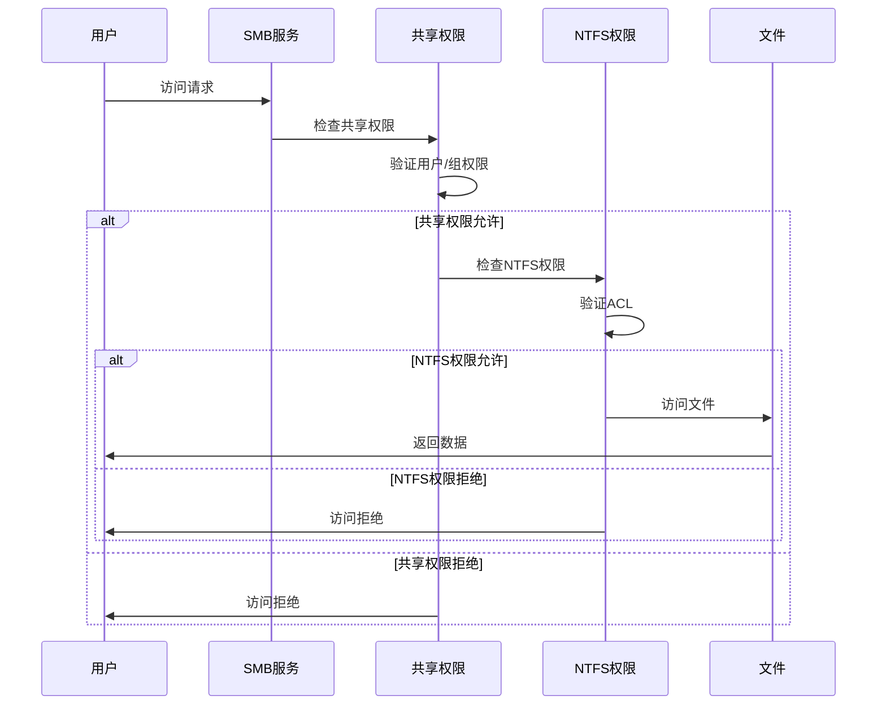
```mermaid
sequenceDiagram
    participant User as 用户
    participant SMB as SMB服务
    participant Share as 共享权限
    participant NTFS as NTFS权限
    participant File as 文件

    User->>SMB: 访问请求
    SMB->>Share: 检查共享权限
    Share->>Share: 验证用户/组权限

    alt 共享权限允许
        Share->>NTFS: 检查NTFS权限
        NTFS->>NTFS: 验证ACL
        alt NTFS权限允许
            NTFS->>File: 访问文件
            File->>User: 返回数据
        else NTFS权限拒绝
            NTFS->>User: 访问拒绝
        end
    else 共享权限拒绝
        Share->>User: 访问拒绝
    end
```

### 10.2 SMB 数据包结构

```
以太网头 | IP头 | TCP头 | SMB头 | SMB命令 | 数据负载
  14字节    20字节  20字节  64字节   可变长度
```

### 10.3 网络抓包示例

```
Frame 1: TCP三次握手
  Ethernet II: 源MAC -> 目标MAC
  IP: 192.168.1.100 -> 192.168.1.200
  TCP: 端口 49723 -> 445 [SYN]

Frame 2: SMB协商
  SMB2: Negotiate Protocol Request
    Dialects: SMB 2.0.2, SMB 2.1, SMB 3.0, SMB 3.0.2, SMB 3.1.1

Frame 3: 会话建立
  SMB2: Session Setup Request
    Security: NTLMSSP/Kerberos Token

Frame 4: 文件操作
  SMB2: Create Request File: Z:\document.txt
  SMB2: Read Request Offset: 0, Length: 65536
```

---

## 十一、性能优化与故障排查

### 11.1 SMB 多通道

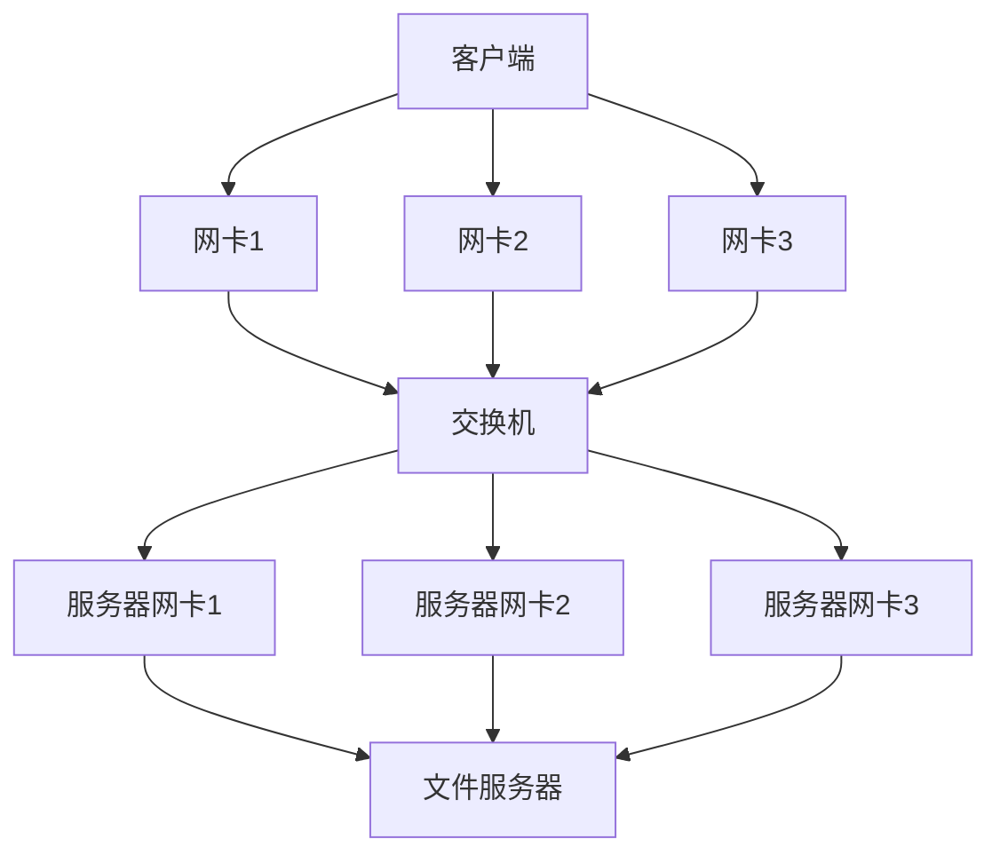
```mermaid
graph TB
    A[客户端] --> B[网卡1]
    A --> C[网卡2]
    A --> D[网卡3]

    B --> E[交换机]
    C --> E
    D --> E

    E --> F[服务器网卡1]
    E --> G[服务器网卡2]
    E --> H[服务器网卡3]

    F --> I[文件服务器]
    G --> I
    H --> I
```

### 11.2 RDMA 支持

- **SMB Direct**：使用 RDMA 技术绕过 CPU
- **零拷贝**：数据直接从网卡到内存
- **低延迟**：减少系统调用开销

### 11.3 诊断命令

```powershell
# 测试SMB连接
Test-NetConnection -ComputerName fileserver -Port 445

# 查看SMB会话
Get-SmbSession

# 查看SMB共享
Get-SmbShare

# 查看SMB连接
Get-SmbConnection

# 启用SMB日志
Set-SmbClientConfiguration -EnableMultiChannel $true
```

### 11.4 常见问题排查流程

```mermaid
graph TB
    A[无法访问Z盘] --> B{网络连通性}
    B -->|不通| C[检查网络配置]
    B -->|通| D{端口445开放}
    D -->|否| E[防火墙配置]
    D -->|是| F{认证成功}
    F -->|否| G[检查凭据]
    F -->|是| H{权限足够}
    H -->|否| I[检查ACL]
    H -->|是| J{服务运行}
    J -->|否| K[启动服务]
    J -->|是| L[深入诊断]
```

---

## 十二、总结

### 12.1 企业级文件共享系统的本质

你看到的"网络位置上的文件共享系统"，本质上是：

```
存储层（文件实际放哪） + 权限层（谁能访问） + 接入层（怎么挂载到电脑） + 安全层（内外隔离、审计、防泄漏）
```

它和普通网盘最大的区别不是"存文件"，而是**"管权限"和"管安全"**。文件本身谁都能存，但谁能看、谁能改、谁能带出去、带出去之后还能不能追回来，这才是企业级文件系统的核心价值。

### 12.2 Windows 文件共享系统的核心流程

1. **请求发起**：应用程序通过 Win32 API 发起文件操作
2. **路径识别**：I/O 管理器识别 UNC 路径并路由到重定向器
3. **协议处理**：SMB 客户端封装请求并通过 TCP/IP 传输
4. **服务器处理**：SMB 服务器解析请求并执行文件操作
5. **响应返回**：结果通过网络返回给客户端

### 12.3 关键协议作用

| 协议 | 作用 |
|---|---|
| SMB | 核心文件共享协议 |
| Kerberos/NTLM | 身份认证 |
| TCP/IP | 网络传输 |
| NTFS | 本地文件系统 |
| OpLock/Lease | 缓存一致性保证 |

### 12.4 Z盘文件共享系统的核心

- **协议标准化**：使用 SMB/NFS 等成熟协议
- **安全可靠**：多层次的安全机制
- **性能优化**：缓存、压缩、多通道等
- **高可用性**：故障转移和数据保护
- **易用性**：透明映射，用户体验良好

这种架构既保证了企业级的可靠性和安全性，又提供了用户友好的访问体验。