# 文件共享平台 · 系统整体架构

> 本文档描述新系统（.NET 8 Web API + Vue 3 SPA）的整体架构、分层职责、核心链路与各框架的可视化关系。

---

## 〇、脱敏声明

本文档**不包含**任何真实的生产敏感信息。以下内容一律使用占位符表示：

| 占位符 | 含义 |
|--------|------|
| `<DB_HOST>` | 数据库服务器地址 |
| `<DB_NAME>` | 数据库实例名 |
| `<DB_USER>` / `<DB_PASSWORD>` | 数据库账号 / 口令 |
| `<FSS_IP>` | 文件服务器地址 |
| `<SSH_USER>` | SSH 专用账号 |
| `<KEY_PATH>` | SSH 私钥文件路径 |
| `<JWT_SECRET>` | JWT 签名密钥 |
| `<LEGACY_DES_KEY>` | 旧系统 DES 密钥 |

> 真实值请通过**安全配置管理**（密钥保管、环境变量、受控配置文件）维护，不要写入任何纳入版本管理的文档。

---

## 一、系统定位

企业内部的**文件共享管理平台**：管理员通过 Web 界面登记、授权、管理文件服务器上的共享文件夹（增删改查 + 续期 + 日志）。

### 新旧系统核心差异

| 维度 | 旧系统 | 新系统 |
|------|--------|--------|
| 技术栈 | ASP.NET Web Forms (.NET Framework 4.5) | .NET 8 Web API + Vue 3 SPA |
| 核心逻辑 | 全部编译在 DLL 中，**无源码** | 完全开源、分层清晰 |
| 与文件服务器联动 | **无**，只写数据库 | **有**，SSH 远程执行共享命令 |
| 共享生效方式 | 人工上文件服务器跑脚本 | **点击即共享**，全自动 |
| 前端交互 | HTML + jQuery + AJAX（整页/半页刷新） | SPA 单页应用、组件化 |

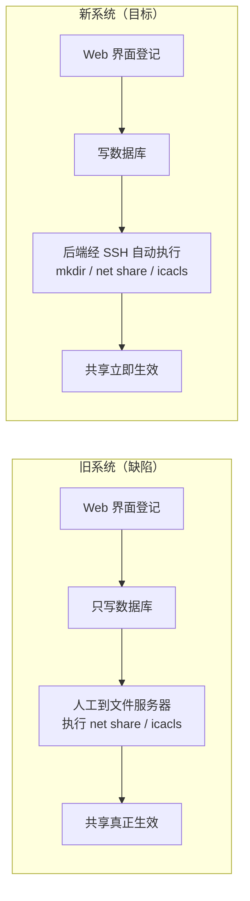
```mermaid
flowchart LR
    subgraph OLD["旧系统（缺陷）"]
        direction TB
        O1["Web 界面登记"] --> O2["只写数据库"]
        O2 --> O3["人工到文件服务器<br/>执行 net share / icacls"]
        O3 --> O4["共享真正生效"]
    end
    subgraph NEW["新系统（目标）"]
        direction TB
        N1["Web 界面登记"] --> N2["写数据库"]
        N2 --> N3["后端经 SSH 自动执行<br/>mkdir / net share / icacls"]
        N3 --> N4["共享立即生效"]
    end
```

---

## 二、总体架构图

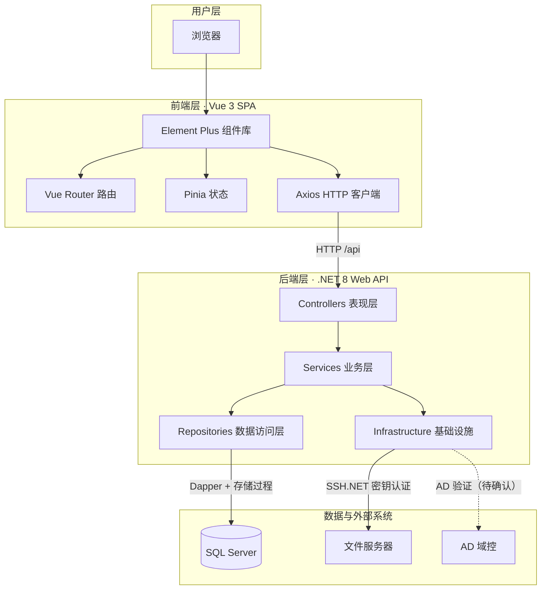
```mermaid
flowchart TB
    subgraph UL["用户层"]
        BR["浏览器"]
    end

    subgraph FEL["前端层 · Vue 3 SPA"]
        UI["Element Plus 组件库"]
        RT["Vue Router 路由"]
        ST["Pinia 状态"]
        AX["Axios HTTP 客户端"]
    end

    subgraph BEL["后端层 · .NET 8 Web API"]
        CT["Controllers 表现层"]
        SV["Services 业务层"]
        RS["Repositories 数据访问层"]
        IF["Infrastructure 基础设施"]
    end

    subgraph DAL["数据与外部系统"]
        DB[("SQL Server")]
        FS["文件服务器"]
        AD["AD 域控"]
    end

    BR --> UI
    UI --> RT
    UI --> ST
    UI --> AX
    AX -->|"HTTP /api"| CT
    CT --> SV
    SV --> RS
    SV --> IF
    RS -->|"Dapper + 存储过程"| DB
    IF -->|"SSH.NET 密钥认证"| FS
    IF -.->|"AD 验证（待确认）"| AD
```

---

## 三、部署架构

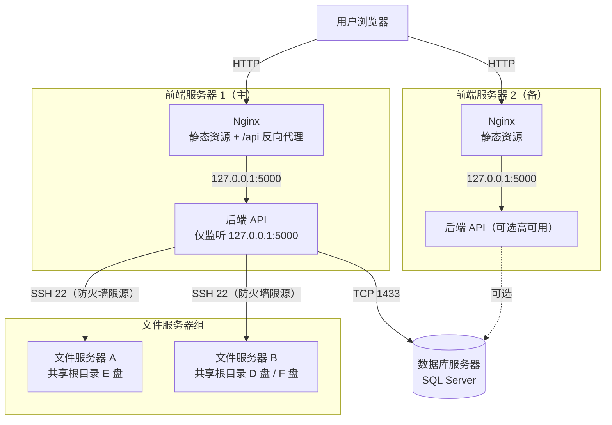
```mermaid
flowchart TB
    U["用户浏览器"]

    subgraph FSPLF["前端服务器 1（主）"]
        NG1["Nginx<br/>静态资源 + /api 反向代理"]
        AP1["后端 API<br/>仅监听 127.0.0.1:5000"]
    end

    subgraph FSPLF2["前端服务器 2（备）"]
        NG2["Nginx<br/>静态资源"]
        AP2["后端 API（可选高可用）"]
    end

    DB[("数据库服务器<br/>SQL Server")]

    subgraph FSS["文件服务器组"]
        FSS1["文件服务器 A<br/>共享根目录 E 盘"]
        FSS2["文件服务器 B<br/>共享根目录 D 盘 / F 盘"]
    end

    U -->|"HTTP"| NG1
    U -->|"HTTP"| NG2
    NG1 -->|"127.0.0.1:5000"| AP1
    NG2 -->|"127.0.0.1:5000"| AP2
    AP1 -->|"TCP 1433"| DB
    AP2 -.->|"可选"| DB
    AP1 -->|"SSH 22（防火墙限源）"| FSS1
    AP1 -->|"SSH 22（防火墙限源）"| FSS2
```

**要点**
- 后端只监听回环地址，由 Nginx 对外，避免 API 直接暴露。
- 文件服务器 22 端口仅放行后端服务器来源 IP。
- 共享根目录**按文件服务器分别配置**（文件服务器 A 与 B 不同）。

---

## 四、前端框架架构

### 4.1 框架清单

| 框架 / 库 | 版本 | 职责 |
|-----------|------|------|
| Vue 3 | ^3.5.6 | 视图层框架、组合式 API |
| Vue Router | ^4.4.5 | 前端路由（history 模式）+ 登录守卫 |
| Pinia | ^2.2.2 | 全局状态（登录态） |
| Element Plus | ^2.8.4 | UI 组件库（中文 locale） |
| Axios | ^1.7.7 | HTTP 客户端 + 请求/响应拦截器 |
| Vite | ^5.4.6 | 开发服务器（含 `/api` 代理）+ 构建 |
| @vitejs/plugin-vue | ^5.1.4 | Vite 的 Vue SFC 编译插件 |

### 4.2 应用启动与组件树

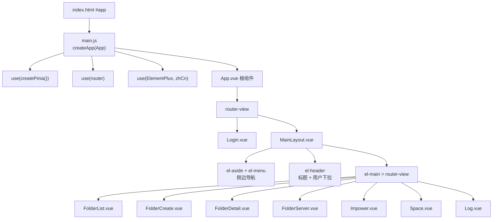
```mermaid
flowchart TD
    IDX["index.html #app"] --> MAIN["main.js<br/>createApp(App)"]
    MAIN --> P1["use(createPinia())"]
    MAIN --> P2["use(router)"]
    MAIN --> P3["use(ElementPlus, zhCn)"]
    MAIN --> APP["App.vue 根组件"]
    APP --> RV["router-view"]
    RV --> LOGIN["Login.vue"]
    RV --> LAYOUT["MainLayout.vue"]
    LAYOUT --> MENU["el-aside + el-menu<br/>侧边导航"]
    LAYOUT --> HDR["el-header<br/>标题 + 用户下拉"]
    LAYOUT --> BODY["el-main > router-view"]
    BODY --> V1["FolderList.vue"]
    BODY --> V2["FolderCreate.vue"]
    BODY --> V3["FolderDetail.vue"]
    BODY --> V4["FolderServer.vue"]
    BODY --> V5["Impower.vue"]
    BODY --> V6["Space.vue"]
    BODY --> V7["Log.vue"]
```

### 4.3 路由结构

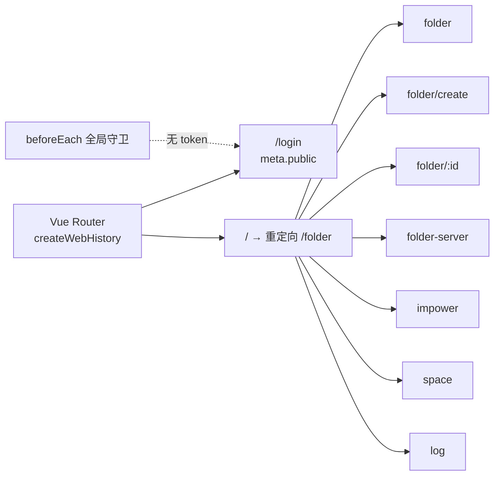
```mermaid
flowchart LR
    RT["Vue Router<br/>createWebHistory"] --> R0["/login<br/>meta.public"]
    RT --> R1["/  → 重定向 /folder"]
    R1 --> C1["folder"]
    R1 --> C2["folder/create"]
    R1 --> C3["folder/:id"]
    R1 --> C4["folder-server"]
    R1 --> C5["impower"]
    R1 --> C6["space"]
    R1 --> C7["log"]
    G["beforeEach 全局守卫"] -.->|"无 token"| R0
```

### 4.4 Pinia 登录态流转

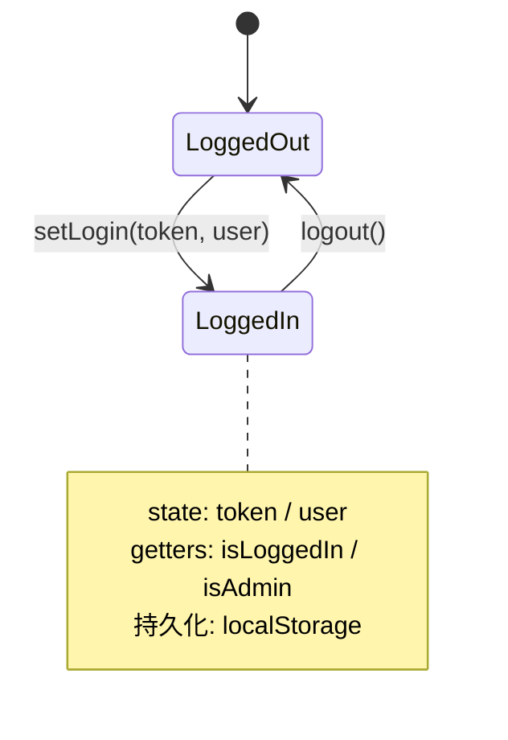
```mermaid
stateDiagram-v2
    [*] --> LoggedOut
    LoggedOut --> LoggedIn : setLogin(token, user)
    LoggedIn --> LoggedOut : logout()
    note right of LoggedIn
        state: token / user
        getters: isLoggedIn / isAdmin
        持久化: localStorage
    end note
```

### 4.5 Axios 请求生命周期

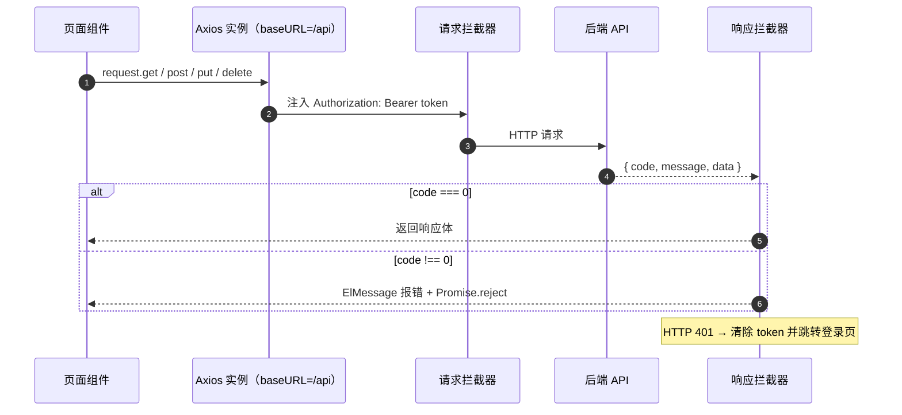
```mermaid
sequenceDiagram
    autonumber
    participant C as 页面组件
    participant AX as Axios 实例（baseURL=/api）
    participant RI as 请求拦截器
    participant SRV as 后端 API
    participant RS as 响应拦截器

    C->>AX: request.get / post / put / delete
    AX->>RI: 注入 Authorization: Bearer token
    RI->>SRV: HTTP 请求
    SRV-->>RS: { code, message, data }
    alt code === 0
        RS-->>C: 返回响应体
    else code !== 0
        RS-->>C: ElMessage 报错 + Promise.reject
    end
    note over RS: HTTP 401 → 清除 token 并跳转登录页
```

### 4.6 Vite 开发与构建

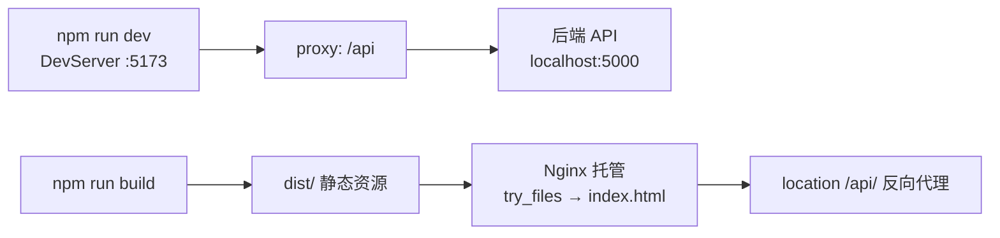
```mermaid
flowchart LR
    DEV["npm run dev<br/>DevServer :5173"] --> PX["proxy: /api"]
    PX --> BE["后端 API<br/>localhost:5000"]
    BLD["npm run build"] --> DIST["dist/ 静态资源"]
    DIST --> NGX["Nginx 托管<br/>try_files → index.html"]
    NGX --> PX2["location /api/ 反向代理"]
```

### 4.7 Element Plus 组件使用分布

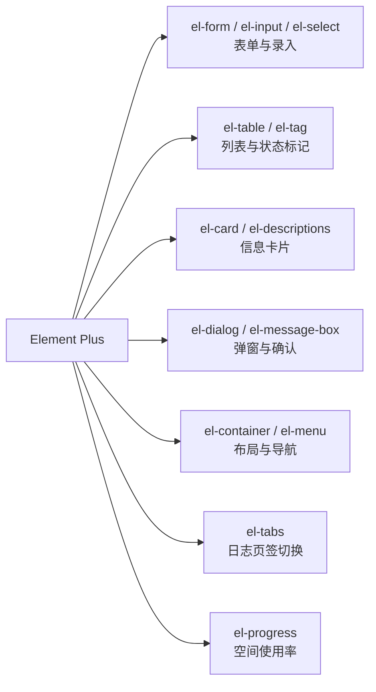
```mermaid
flowchart LR
    EP["Element Plus"] --> A1["el-form / el-input / el-select<br/>表单与录入"]
    EP --> A2["el-table / el-tag<br/>列表与状态标记"]
    EP --> A3["el-card / el-descriptions<br/>信息卡片"]
    EP --> A4["el-dialog / el-message-box<br/>弹窗与确认"]
    EP --> A5["el-container / el-menu<br/>布局与导航"]
    EP --> A6["el-tabs<br/>日志页签切换"]
    EP --> A7["el-progress<br/>空间使用率"]
```

---

## 五、后端框架架构

### 5.1 框架清单

| 框架 / 库 | 版本 | 职责 |
|-----------|------|------|
| .NET | net8.0 (LTS) | 运行时与基础库 |
| ASP.NET Core Web API | 8.0 | HTTP 管道、路由、DI、模型绑定 |
| Dapper | 2.1.35 | 轻量 ORM，调用存储过程 |
| Microsoft.Data.SqlClient | 5.2.1 | SQL Server 驱动 |
| SSH.NET (Renci.SshNet) | 2026.0.0 | SSH 远程执行共享命令 |
| Microsoft.AspNetCore.Authentication.JwtBearer | 8.0.8 | JWT 认证中间件 |
| System.IdentityModel.Tokens.Jwt | 8.0.1 | JWT 生成与校验 |
| Serilog.AspNetCore | 8.0.2 | 结构化日志 |
| Swashbuckle.AspNetCore | 6.7.3 | Swagger / OpenAPI 文档 |

### 5.2 分层架构与依赖方向

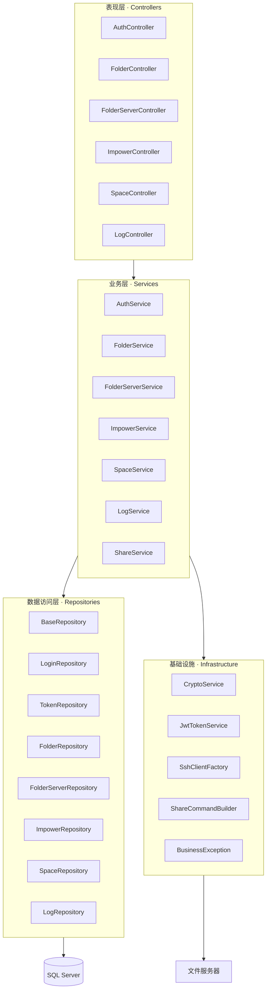
```mermaid
flowchart TB
    subgraph L1["表现层 · Controllers"]
        direction LR
        CT1["AuthController"]
        CT2["FolderController"]
        CT3["FolderServerController"]
        CT4["ImpowerController"]
        CT5["SpaceController"]
        CT6["LogController"]
    end

    subgraph L2["业务层 · Services"]
        direction LR
        SV1["AuthService"]
        SV2["FolderService"]
        SV3["FolderServerService"]
        SV4["ImpowerService"]
        SV5["SpaceService"]
        SV6["LogService"]
        SV7["ShareService"]
    end

    subgraph L3["数据访问层 · Repositories"]
        direction LR
        RP0["BaseRepository"]
        RP1["LoginRepository"]
        RP2["TokenRepository"]
        RP3["FolderRepository"]
        RP4["FolderServerRepository"]
        RP5["ImpowerRepository"]
        RP6["SpaceRepository"]
        RP7["LogRepository"]
    end

    subgraph L4["基础设施 · Infrastructure"]
        direction LR
        IF1["CryptoService"]
        IF2["JwtTokenService"]
        IF3["SshClientFactory"]
        IF4["ShareCommandBuilder"]
        IF5["BusinessException"]
    end

    L1 --> L2
    L2 --> L3
    L2 --> L4
    L3 --> DB[("SQL Server")]
    L4 --> FS["文件服务器"]
```

### 5.3 依赖注入关系

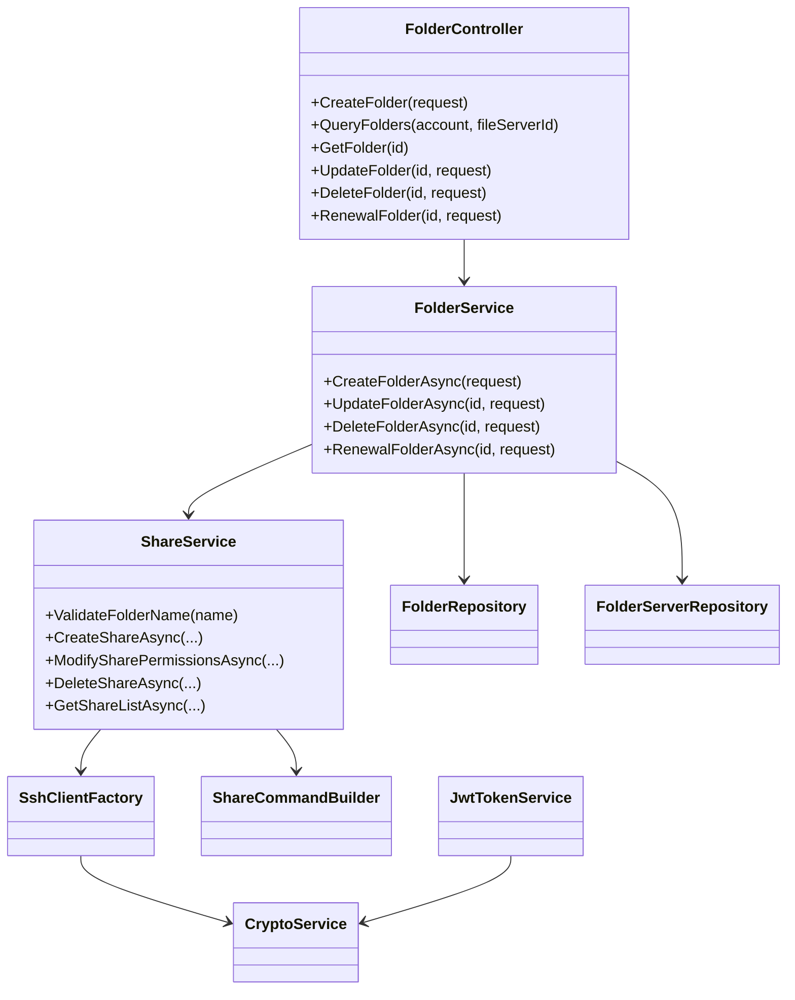
```mermaid
classDiagram
    class FolderController {
        +CreateFolder(request)
        +QueryFolders(account, fileServerId)
        +GetFolder(id)
        +UpdateFolder(id, request)
        +DeleteFolder(id, request)
        +RenewalFolder(id, request)
    }
    class FolderService {
        +CreateFolderAsync(request)
        +UpdateFolderAsync(id, request)
        +DeleteFolderAsync(id, request)
        +RenewalFolderAsync(id, request)
    }
    class ShareService {
        +ValidateFolderName(name)
        +CreateShareAsync(...)
        +ModifySharePermissionsAsync(...)
        +DeleteShareAsync(...)
        +GetShareListAsync(...)
    }
    class FolderRepository
    class FolderServerRepository
    class SshClientFactory
    class ShareCommandBuilder
    class CryptoService
    class JwtTokenService

    FolderController --> FolderService
    FolderService --> FolderRepository
    FolderService --> FolderServerRepository
    FolderService --> ShareService
    ShareService --> SshClientFactory
    ShareService --> ShareCommandBuilder
    SshClientFactory --> CryptoService
    JwtTokenService --> CryptoService
```

> 生命周期：`CryptoService` / `JwtTokenService` / `SshClientFactory` / `ShareCommandBuilder` 为 **Singleton**；Repositories 与 Services 均为 **Scoped**。

### 5.4 ASP.NET Core 请求管道

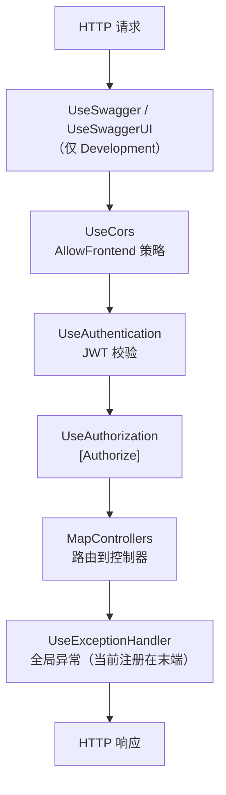
```mermaid
flowchart TD
    REQ["HTTP 请求"] --> M1["UseSwagger / UseSwaggerUI<br/>（仅 Development）"]
    M1 --> M2["UseCors<br/>AllowFrontend 策略"]
    M2 --> M3["UseAuthentication<br/>JWT 校验"]
    M3 --> M4["UseAuthorization<br/>[Authorize]"]
    M4 --> M5["MapControllers<br/>路由到控制器"]
    M5 --> M6["UseExceptionHandler<br/>全局异常（当前注册在末端）"]
    M6 --> RES["HTTP 响应"]
```

> ⚠️ 图中 `UseExceptionHandler` 位于 `MapControllers` **之后**，按中间件顺序它无法捕获控制器抛出的异常，属于待修缺陷（见附录）。

### 5.5 认证与令牌生命周期

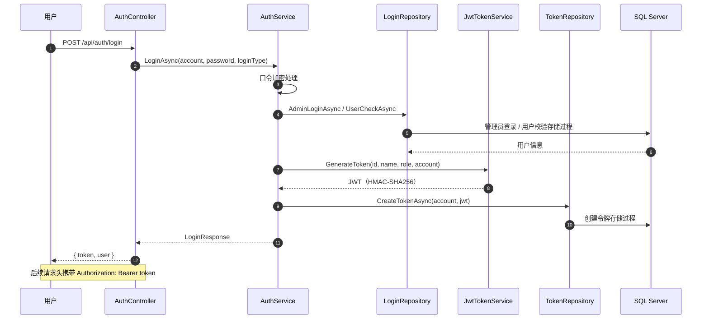
```mermaid
sequenceDiagram
    autonumber
    participant U as 用户
    participant AC as AuthController
    participant AS as AuthService
    participant LR as LoginRepository
    participant JT as JwtTokenService
    participant TR as TokenRepository
    participant DB as SQL Server

    U->>AC: POST /api/auth/login
    AC->>AS: LoginAsync(account, password, loginType)
    AS->>AS: 口令加密处理
    AS->>LR: AdminLoginAsync / UserCheckAsync
    LR->>DB: 管理员登录 / 用户校验存储过程
    DB-->>LR: 用户信息
    AS->>JT: GenerateToken(id, name, role, account)
    JT-->>AS: JWT（HMAC-SHA256）
    AS->>TR: CreateTokenAsync(account, jwt)
    TR->>DB: 创建令牌存储过程
    AS-->>AC: LoginResponse
    AC-->>U: { token, user }
    note over U,AC: 后续请求头携带 Authorization: Bearer token
```

---

## 六、核心链路：点击即共享

### 6.1 创建共享时序

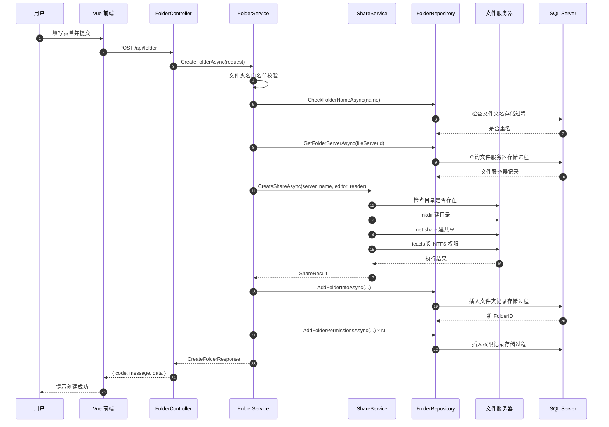
```mermaid
sequenceDiagram
    autonumber
    participant U as 用户
    participant V as Vue 前端
    participant C as FolderController
    participant S as FolderService
    participant SR as ShareService
    participant R as FolderRepository
    participant F as 文件服务器
    participant D as SQL Server

    U->>V: 填写表单并提交
    V->>C: POST /api/folder
    C->>S: CreateFolderAsync(request)
    S->>S: 文件夹名白名单校验
    S->>R: CheckFolderNameAsync(name)
    R->>D: 检查文件夹名存储过程
    D-->>R: 是否重名
    S->>R: GetFolderServerAsync(fileServerId)
    R->>D: 查询文件服务器存储过程
    D-->>R: 文件服务器记录
    S->>SR: CreateShareAsync(server, name, editor, reader)
    SR->>F: 检查目录是否存在
    SR->>F: mkdir 建目录
    SR->>F: net share 建共享
    SR->>F: icacls 设 NTFS 权限
    F-->>SR: 执行结果
    SR-->>S: ShareResult
    S->>R: AddFolderInfoAsync(...)
    R->>D: 插入文件夹记录存储过程
    D-->>R: 新 FolderID
    S->>R: AddFolderPermissionsAsync(...) x N
    R->>D: 插入权限记录存储过程
    S-->>C: CreateFolderResponse
    C-->>V: { code, message, data }
    V-->>U: 提示创建成功
```

### 6.2 状态机与补偿

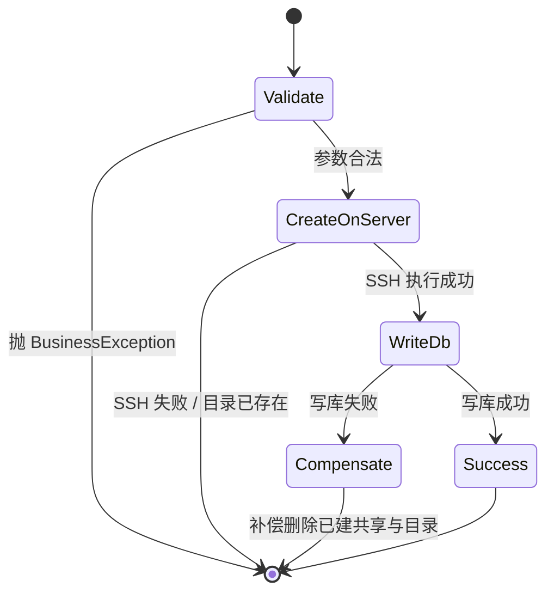
```mermaid
stateDiagram-v2
    [*] --> Validate
    Validate --> CreateOnServer : 参数合法
    Validate --> [*] : 抛 BusinessException
    CreateOnServer --> WriteDb : SSH 执行成功
    CreateOnServer --> [*] : SSH 失败 / 目录已存在
    WriteDb --> Success : 写库成功
    WriteDb --> Compensate : 写库失败
    Compensate --> [*] : 补偿删除已建共享与目录
    Success --> [*]
```

**事务顺序（已确认的设计）**：先 SSH 建共享 → 再写数据库 → 写库失败则补偿删除。

### 6.3 修改 / 删除 / 续期

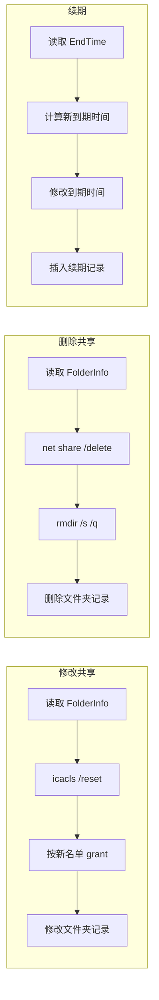
```mermaid
flowchart LR
    subgraph MOD["修改共享"]
        M1["读取 FolderInfo"] --> M2["icacls /reset"] --> M3["按新名单 grant"] --> M4["修改文件夹记录"]
    end
    subgraph DEL["删除共享"]
        D1["读取 FolderInfo"] --> D2["net share /delete"] --> D3["rmdir /s /q"] --> D4["删除文件夹记录"]
    end
    subgraph REN["续期"]
        R1["读取 EndTime"] --> R2["计算新到期时间"] --> R3["修改到期时间"] --> R4["插入续期记录"]
    end
```

---

## 七、数据访问与存储

### 7.1 Dapper 调用链

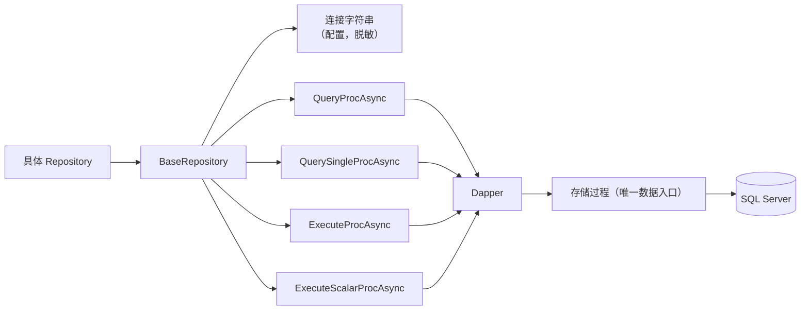
```mermaid
flowchart LR
    RP["具体 Repository"] --> BR["BaseRepository"]
    BR --> CS["连接字符串<br/>（配置，脱敏）"]
    BR --> M1["QueryProcAsync"]
    BR --> M2["QuerySingleProcAsync"]
    BR --> M3["ExecuteProcAsync"]
    BR --> M4["ExecuteScalarProcAsync"]
    M1 --> DP["Dapper"]
    M2 --> DP
    M3 --> DP
    M4 --> DP
    DP --> SP["存储过程（唯一数据入口）"]
    SP --> DB[("SQL Server")]
```

### 7.2 存储过程清单（按业务域）

| 业务域 | 存储过程 |
|--------|----------|
| 认证 / 授权 | 管理员登录、用户校验、获取登录信息、人员授权增删改查 |
| 共享文件夹 | 插入、查重、查询、修改、删除、修改到期时间 |
| 文件夹权限 | 插入权限、查询列表、查询全部 |
| 文件服务器 | 插入、查询、删除、获取列表、按授权码获取、获取授权码列表 |
| 空间 / 日志 | 空间查询、操作日志、续期日志查询/插入 |
| 令牌 | 创建、校验、更新 |

### 7.3 数据模型（依据现有文档推断）

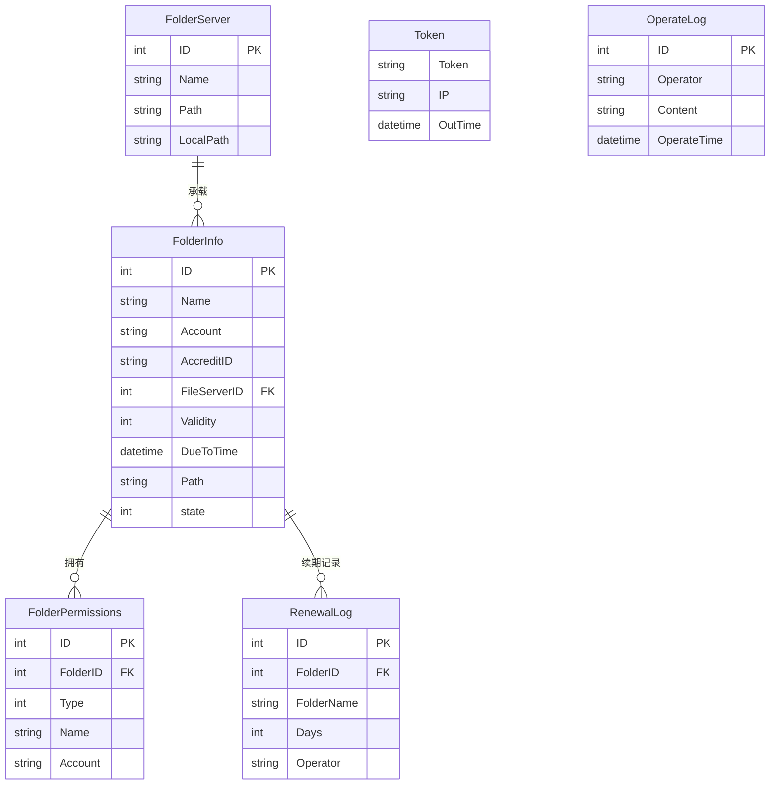
```mermaid
erDiagram
    FolderServer ||--o{ FolderInfo : "承载"
    FolderInfo ||--o{ FolderPermissions : "拥有"
    FolderInfo ||--o{ RenewalLog : "续期记录"

    FolderServer {
        int ID PK
        string Name
        string Path
        string LocalPath
    }
    FolderInfo {
        int ID PK
        string Name
        string Account
        string AccreditID
        int FileServerID FK
        int Validity
        datetime DueToTime
        string Path
        int state
    }
    FolderPermissions {
        int ID PK
        int FolderID FK
        int Type
        string Name
        string Account
    }
    RenewalLog {
        int ID PK
        int FolderID FK
        string FolderName
        int Days
        string Operator
    }
    Token {
        string Token
        string IP
        datetime OutTime
    }
    OperateLog {
        int ID PK
        string Operator
        string Content
        datetime OperateTime
    }
```

> `Type`：1 = 编辑者，2 = 只读者。

---

## 八、文件服务器共享操作

### 8.1 SSH 命令执行链

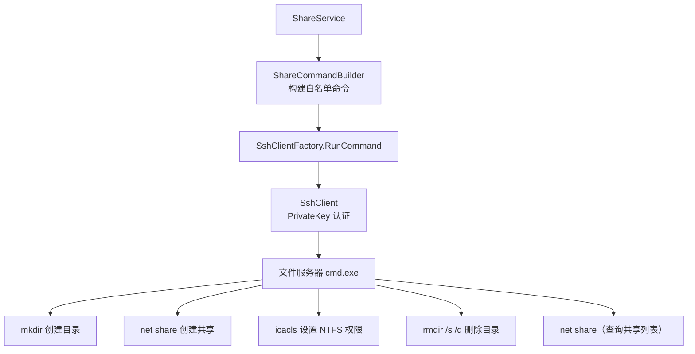
```mermaid
flowchart TB
    SS["ShareService"] --> CB["ShareCommandBuilder<br/>构建白名单命令"]
    CB --> RC["SshClientFactory.RunCommand"]
    RC --> CL["SshClient<br/>PrivateKey 认证"]
    CL --> SH["文件服务器 cmd.exe"]
    SH --> C1["mkdir 创建目录"]
    SH --> C2["net share 创建共享"]
    SH --> C3["icacls 设置 NTFS 权限"]
    SH --> C4["rmdir /s /q 删除目录"]
    SH --> C5["net share（查询共享列表）"]
```

### 8.2 命令白名单

| 操作 | 命令模板 |
|------|----------|
| 建目录 | `mkdir "<LocalPath>"` |
| 建共享 | `net share "<Name>"="<LocalPath>" /grant:everyone,READ` |
| 删共享 | `net share "<Name>" /delete` |
| 删目录 | `rmdir /s /q "<LocalPath>"` |
| 设权限 | `icacls "<LocalPath>" /grant "<Account>:(OI)(CI)<M 或 R>"` |
| 重置权限 | `icacls "<LocalPath>" /reset` |
| 查共享 | `net share` |

### 8.3 注入防护

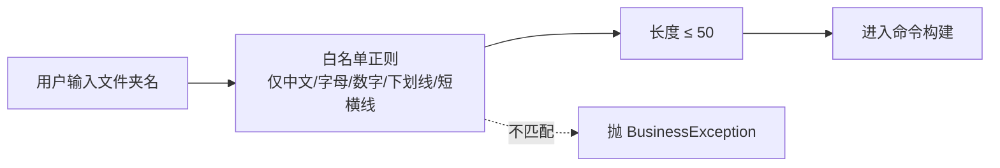
```mermaid
flowchart LR
    IN["用户输入文件夹名"] --> RG["白名单正则<br/>仅中文/字母/数字/下划线/短横线"]
    RG --> LEN["长度 ≤ 50"]
    LEN --> OK["进入命令构建"]
    RG -.->|不匹配| ERR["抛 BusinessException"]
```

---

## 九、配置架构（脱敏）

```mermaid
flowchart TB
    CFG["appsettings.json"] --> S1["ConnectionStrings:Default<br/>DB_HOST / DB_NAME"]
    CFG --> S2["Jwt<br/>Issuer / Audience / JWT_SECRET / ExpireMinutes"]
    CFG --> S3["Cors:AllowedOrigins<br/>前端来源白名单"]
    CFG --> S4["FileServers:Servers[]<br/>Id / Name / Host / Port / User / KeyPath / ShareRootPath"]
    CFG --> S5["Crypto<br/>LEGACY_DES_KEY / ConfigOffset / DbPasswordOffset"]
    CFG --> S6["Serilog<br/>Console + File Sink"]
    S4 --> SVC["SshClientFactory / ShareService"]
```

> 生产环境建议：敏感项（连接串、JWT 密钥、DES 密钥）改由**环境变量或密钥管理服务**注入，不落明文配置文件。

---

## 十、日志架构

```mermaid
flowchart LR
    APP["业务代码 ILogger"] --> SL["Serilog"]
    SL --> CON["Console Sink"]
    SL --> FILE["File Sink<br/>logs/log-.txt 按天滚动"]
    SL --> ENR["Enrich.FromLogContext"]
```

---

## 十一、框架版本总览

| 层 | 组件 | 版本 |
|----|------|------|
| 前端 | Vue | 3.5.6 |
| 前端 | Vue Router | 4.4.5 |
| 前端 | Pinia | 2.2.2 |
| 前端 | Element Plus | 2.8.4 |
| 前端 | Axios | 1.7.7 |
| 前端 | Vite | 5.4.6 |
| 后端 | .NET | 8.0 (LTS) |
| 后端 | ASP.NET Core | 8.0 |
| 后端 | Dapper | 2.1.35 |
| 后端 | Microsoft.Data.SqlClient | 5.2.1 |
| 后端 | SSH.NET | 2026.0.0 |
| 后端 | JwtBearer | 8.0.8 |
| 后端 | Serilog.AspNetCore | 8.0.2 |
| 后端 | Swashbuckle | 6.7.3 |
| 数据库 | SQL Server | 复用现有实例 |
| 中间件 | Nginx | 静态托管 + 反向代理 |

---

## 十二、附录：已知不足（架构视角）

> 详细逐条分析见评审记录；此处仅列架构层面需要关注的点。

| # | 位置 | 问题 | 影响 |
|---|------|------|------|
| 1 | `ShareService` | SSH 连接信息未从配置注入模型 | 核心链路不可用 |
| 2 | `ShareService` | 目录存在性判断 `Contains("EXISTS")` 会匹配 `NOT_EXISTS` | 创建必然失败 |
| 3 | `Program.cs` | 未配置 JSON camelCase 命名策略 | 前端读取字段全部 undefined |
| 4 | `ShareCommandBuilder` | 共享级权限 `everyone,READ` 会封顶 NTFS 的 M 权限 | 编辑者实际无法写入 |
| 5 | `FolderService` | 修改共享未同步数据库权限表 | 权限记录与真实权限不一致 |
| 6 | `FolderService` | `ShareStatus` 状态跟踪未落库 | 补偿失败后无法追踪 |
| 7 | `FolderService` | 未使用 `AccreditID` 解析文件服务器 | 授权关系未校验 |
| 8 | `Program.cs` | `UseExceptionHandler` 注册在 `MapControllers` 之后 | 无法捕获控制器异常 |
| 9 | `SpaceService` | 已用/剩余/使用率硬编码为 0 | 空间管理未真正实现 |
| 10 | 仓库根目录 | 文档与配置含明文生产凭据 | 严重安全风险 |
| 11 | `package.json` | 未声明 `@element-plus/icons-vue` 依赖 | 构建依赖隐式提升 |

---

*本文档基于当前代码与配套设计文档整理；涉及存储过程真实签名、SSH 配置归属、登录口令加密方式等仍待确认的事项，以最终确认结论为准。*
