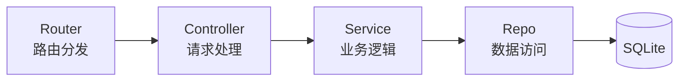
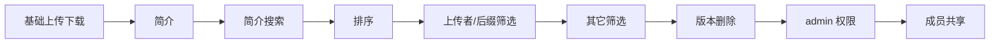

> **项目定位**：小组文件/脚本共享系统，支持版本管理、简介搜索、排序筛选、成员共享、管理员权限。
> **技术栈**：纯 Node.js 零依赖（无任何 npm 包），SQLite 存储（node:sqlite），原生 HTML/CSS/JS 前端。
> **架构**：分层架构 Router → Controller → Service → Repo，职责清晰，便于扩展。

---

## 一、系统概览

### 核心能力

| 能力 | 说明 |
|---|---|
| **用户认证** | scrypt 密码哈希、HMAC 签名 token、登录失败锁定 |
| **文件管理** | 上传/下载/预览/重命名/简介/删除 |
| **版本管理** | 多版本、回滚、删除版本 |
| **搜索筛选** | 关键词（名称+简介）、上传者、后缀、排序 |
| **共享协作** | 公共文件、指定成员共享 |
| **权限控制** | owner 优先，admin 拥有全部管理权 |

### 架构分层



**四层分离的价值**：每个新功能（简介、筛选、版本删除、共享）都能按固定套路在四层各加一段代码，改动清晰、可测试、可回滚。这是整个项目能快速迭代的基石。

---

## 二、开发过程回顾

### 阶段一：基础搭建

- **零依赖架构**：手写 multipart 解析、静态文件服务、token 签名
- **SQLite 建表 + WAL 模式**：保证并发读写

### 阶段二：核心功能迭代

按用户需求逐步叠加：



### 阶段三：部署与运维

- **内网访问**：局域网 IP + 防火墙
- **上传 GitHub**：版本管理
- **性能与安全检测**

---

## 三、关键经验

### 1. 分层架构的价值

Router → Controller → Service → Repo 四层分离，让每个新功能都能按固定套路在四层各加一段代码，改动清晰、可测试、可回滚。**这是整个项目能快速迭代的基石。**

### 2. 零依赖的取舍

| 优点 | 代价 |
|---|---|
| 无供应链风险 | 手写 multipart 解析 |
| 部署简单（只需 Node 环境） | 手写 token 签名 |
| 体积小 | 手写静态服务 |
| | 需自行处理边界情况 |

### 3. 数据库迁移策略

用 `PRAGMA table_info` 检查列是否存在，再 `ALTER TABLE` 增量迁移，兼容旧数据库，避免破坏已有数据。

```sql
-- 示例：检查列是否存在，不存在则添加
PRAGMA table_info(files);
-- 若缺少某列，则执行
ALTER TABLE files ADD COLUMN description TEXT DEFAULT '';
```

### 4. 安全防护意识

| 风险 | 防护措施 |
|---|---|
| SQL 注入 | 排序字段用白名单校验 |
| 路径穿越 | 文件名/路径严格校验 |
| 密码安全 | scrypt 加盐哈希 |
| 登录爆破 | 失败次数锁定 |

---

## 四、踩过的坑与教训

### 教训 1：前端内联传 JSON 导致属性损坏（最深刻）

**问题**：共享按钮 `onclick` 内联传入 `JSON.stringify(sharedWith)`，当含双引号时提前终止 HTML 属性，导致按钮无法点击、无法覆盖共享。

**教训**：不要在 HTML 属性内联传复杂 JSON。应只传 `id`，从数据源（全局缓存/接口）读取。**这是本次最典型的"看似简单实则致命"的 bug。**

```html
<!-- ❌ 错误：内联传 JSON，双引号会破坏属性 -->
<button onclick="share({{ JSON.stringify(sharedWith) }})">共享</button>

<!-- ✅ 正确：只传 id，从数据源读取 -->
<button onclick="share(fileId)">共享</button>
```

### 教训 2：API 路径前缀重复

**问题**：`api('/api/users')` 因 `api()` 已自动加 `/api` 前缀，导致双重前缀 404。

**教训**：封装统一请求函数时，调用方必须清楚前缀规则，避免重复拼接。

```javascript
// ❌ 错误：api() 已自动加 /api，这里又写了一遍
api('/api/users')

// ✅ 正确：只写相对路径
api('/users')
```

### 教训 3：cmd 批处理语法陷阱

**问题**：测试登录锁定时，cmd 的 `for` 循环报"此时不应有 i"。

**教训**：复杂逻辑用 Node 脚本而非 cmd 批处理，跨平台更可靠。

### 教训 4：Git 远程冲突

**问题**：GitHub 网页端修改 README 后，本地 push 被拒。

**教训**：多人/多端协作时，push 前先 `pull --allow-unrelated-histories` 合并。

```bash
git pull origin main --allow-unrelated-histories
git push origin main
```

### 教训 5：删除操作的边界保护

**问题**：删除最后一个版本时返回 500。

**教训**：删除类操作必须考虑边界条件（至少保留一个版本），并在 service 层捕获转换为友好错误。

```javascript
// 至少保留一个版本
if (versions.length <= 1) {
  throw new Error('至少保留一个版本，无法删除');
}
```

### 教训 6：测试污染生产数据

**问题**：测试过程中 admin 账号被锁定、testmember 残留。

**教训**：测试应使用独立数据或测试账号，避免污染生产数据；测试后需清理。

---

## 五、总体心得

1. **小步快跑**：每个需求独立迭代、独立测试、独立提交，问题定位快。
2. **前后端联动**：功能改动需同时考虑前端展示与后端逻辑，尤其注意数据传递方式（内联 vs 接口）。
3. **权限模型要统一**：owner 优先 + admin 兜底，通过 `_requireOwner` / `_canRead` 集中管理，避免散落各处。
4. **边界与异常**：删除、空数据、非法输入都要有兜底，避免 500。
5. **版本管理**：Git 提交记录清晰，每个功能一个 commit，便于回溯。

---

> **总结**：这个系统从零到一，经历了功能叠加、bug 修复、部署上线、GitHub 托管，是一个完整且典型的全栈小项目实践。它教会我的不仅是技术，更是**如何用分层架构应对快速迭代、如何用安全意识规避常见风险、如何从踩坑中沉淀方法论**。

---

## 📦 项目地址

- **GitHub**：[Filehub-4-Group](https://github.com/Dr1ft0/Filehub-4-Group)

> 欢迎 Star、Fork，也欢迎提 Issue 交流讨论。