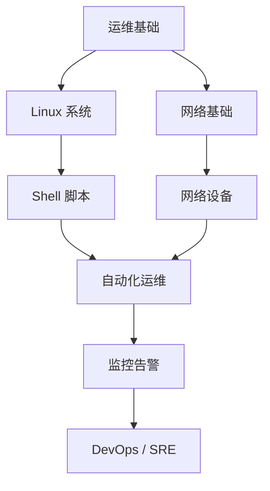

# 📚 知识库索引

这里是所有知识沉淀的**总入口**。本地有完整的笔记库（DSH 技能库、故障清单、学习路线），这里是对外展示的部分。

---

## 📌 故障排查


**运维故障排查清单（40 项）** —— 网络/系统/存储/数据库/安全/虚拟化常见故障速查


- [运维故障排查清单（40 项）]() —— 网络/系统/存储/数据库/安全/虚拟化常见故障速查

---

## ⚙️ 自动化运维


**文件共享系统自动化运维方案** —— 备份/监控/同步/清理/权限管理五大模块的通用脚本逻辑


- [文件共享系统自动化运维方案]() —— 备份/监控/同步/清理/权限管理五大模块的通用脚本逻辑

---

## 🗂 按栏目逛

| 栏目 | 入口 | 内容 |
|---|---|---|
| 运维周记 | [归档](/archives/) | 每周工作记录 |
| 故障复盘 | [分类](/categories/故障复盘/) | 真实故障的完整复盘 |
| 技术笔记 | [分类](/categories/技术笔记/) | Linux / 网络 / 容器学习笔记 |

---

## 🧭 学习路线

---

## 🗓 更新节奏

- **每周日**：更新一篇周记
- **每个故障 24h 内**：更新一篇复盘
- **每月末**：更新本索引页

---

## 📊 站点统计


本站用 Hexo 构建，源码在 GitHub，push 自动部署。


> 如果你觉得某篇文章对你有帮助，欢迎点赞、收藏、分享。也欢迎在评论区交流讨论。
